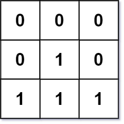
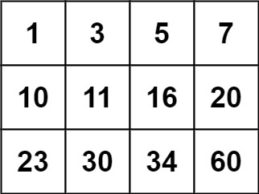

# 74. 搜索二维矩阵

## 题目

难度: 中等

编写一个高效的算法来判断 m x n 矩阵中，是否存在一个目标值。该矩阵具有如下特性：

- 每行中的整数从左到右按升序排列。
- 每行的第一个整数大于前一行的最后一个整数。

**示例 1：**



```
输入：matrix = [[1,3,5,7],[10,11,16,20],[23,30,34,60]], target = 3
输出：true

```

**示例 2：**



```
输入：matrix = [[1,3,5,7],[10,11,16,20],[23,30,34,60]], target = 13
输出：false

```

> 来源: 力扣（LeetCode）  
> 链接: <https://leetcode.cn/problems/search-a-2d-matrix/>  
> 著作权归领扣网络所有。商业转载请联系官方授权，非商业转载请注明出处。

## 答案

```c++
class Solution {
public:
    bool searchMatrix(vector<vector<int>>& matrix, int target) {
        int n_row = matrix.size();
        int n_col = matrix[0].size();

        // 二分法先排除一些特殊情况
        if (matrix[0][0] > target || matrix[n_row - 1][n_col - 1] < target) {
            return false;
        }

        // 二分法先找到行 row_idx
        int left = 0;
        int right = n_row - 1;
        int row_idx = 0;
        while (left <= right) {
            int mid = left + (right - left) / 2;
            if (matrix[mid][0] == target) {
                return true;
            }
            if (matrix[mid][0] > target) {
                row_idx = mid - 1;
                right = mid - 1;
            } else {
                row_idx = mid;
                left = mid + 1;
            }
        }

        // 再找到列
        left = 0;
        right = n_col - 1;
        while (left <= right) {
            int mid = left + (right - left) / 2;
            if (matrix[row_idx][mid] == target) {
                return true;
            }
            if (matrix[row_idx][mid] > target) {
                right = mid - 1;
            } else {
                left = mid + 1;
            }
        }

        return false;
    }
};
```
