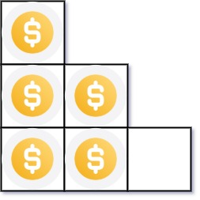

# 441. 排列硬币

## 题目

难度: 简单

你总共有 n 枚硬币，并计划将它们按阶梯状排列。对于一个由 k 行组成的阶梯，其第 i 行必须正好有 i 枚硬币。阶梯的最后一行 **可能** 是不完整的。

给你一个数字 n ，计算并返回可形成 **完整阶梯行** 的总行数。

**示例 1：**



```
输入：n = 5
输出：2
解释：因为第三行不完整，所以返回 2 。

```

**示例 2：**


```
输入：n = 8
输出：3
解释：因为第四行不完整，所以返回 3 。

```

> 来源: 力扣（LeetCode）  
> 链接: <https://leetcode.cn/problems/arranging-coins/>  
> 著作权归领扣网络所有。商业转载请联系官方授权，非商业转载请注明出处。

## 答案

```c++
class Solution {
public:
    int arrangeCoins(int n) {
        // 首先 p 个完整的阶梯硬币数是 (1 + p) * p / 2
        auto helper = [](const int64_t p) -> int64_t {
            return (1 + p) * p / 2;
        };

        int left = 1;
        int right = n;
        int ans = -1;

        while (left <= right) {
            int mid = left + (right - left) / 2;

            if (helper(mid) == n) {
                return mid;
            }

            if (helper(mid) > n) {
                ans = mid - 1;
                right = mid - 1;
            } else {
                left = mid + 1;
                ans = mid;
            }
        }

        return ans;
    }
};
```
