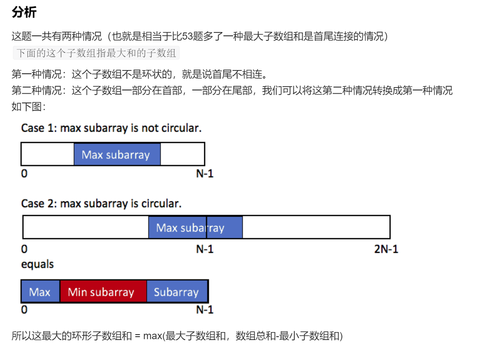

# 918. 环形子数组的最大和

## 题目

难度: 中等

给定一个长度为 n 的**环形整数数组** nums ，返回 nums 的非空 **子数组** 的最大可能和。

**环形数组**意味着数组的末端将会与开头相连呈环状。形式上， nums[i] 的下一个元素是 nums[(i + 1) % n] ， nums[i] 的前一个元素是 nums[(i - 1 + n) % n] 。

**子数组** 最多只能包含固定缓冲区 nums 中的每个元素一次。形式上，对于子数组 nums[i], nums[i + 1], ..., nums[j] ，不存在 i <= k1, k2 <= j 其中 k1 % n == k2 % n 。

**示例 1：**

```
输入：nums = [1,-2,3,-2]
输出：3
解释：从子数组 [3] 得到最大和 3

```

**示例 2：**

```
输入：nums = [5,-3,5]
输出：10
解释：从子数组 [5,5] 得到最大和 5 + 5 = 10

```

**示例 3：**

```
输入：nums = [3,-2,2,-3]
输出：3
解释：从子数组 [3] 和 [3,-2,2] 都可以得到最大和 3

```

> 来源: 力扣（LeetCode）  
> 链接: <https://leetcode.cn/problems/maximum-sum-circular-subarray/>  
> 著作权归领扣网络所有。商业转载请联系官方授权，非商业转载请注明出处。

## 思路



## 答案

```c++
class Solution {
public:
    int maxSubarraySumCircular(vector<int>& nums) {
        int n = nums.size();

        // 数组总和
        int sum = nums[0];
        // max_dp[i] 表示以 i 为下标的最大子数组和
        std::vector<int> max_dp(n);
        max_dp[0] = nums[0];
        // min_dp[i] 表示以 i 为下标的最小子数组和
        std::vector<int> min_dp(n);
        min_dp[0] = nums[0];

        // 最大子数组和
        int max_sum = max_dp[0];
        // 最小子数组和
        int min_sum = min_dp[0];
        for (int i = 1; i < n; i++) {
            max_dp[i] = std::max(max_dp[i - 1] + nums[i], nums[i]);
            max_sum = std::max(max_sum, max_dp[i]);

            min_dp[i] = std::min(min_dp[i - 1] + nums[i], nums[i]);
            min_sum = std::min(min_sum, min_dp[i]);

            sum += nums[i];
        }

        // std::cout << "max_sum: " << max_sum << std::endl;
        // std::cout << "min_sum: " << min_sum << std::endl;
        // std::cout << "sum: " << sum << std::endl;

        if (max_sum < 0) {
            return max_sum;
        }
        return std::max(max_sum, sum - min_sum);
    }
};
```
