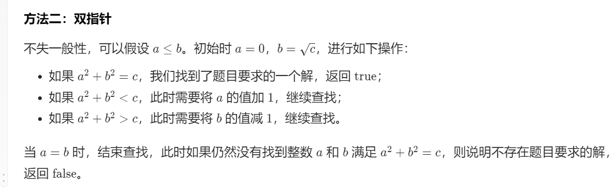

# 633. 平方数之和

## 题目

难度: 中等

给定一个非负整数 c ，你要判断是否存在两个整数 a 和 b，使得 a<sup>2</sup> + b<sup>2</sup> = c 。

**示例 1：**

```
输入：c = 5
输出：true
解释：1 * 1 + 2 * 2 = 5

```

**示例 2：**

```
输入：c = 3
输出：false

```

> 来源: 力扣（LeetCode）  
> 链接: <https://leetcode.cn/problems/sum-of-square-numbers/>  
> 著作权归领扣网络所有。商业转载请联系官方授权，非商业转载请注明出处。

## 思路



## 答案

```c++
class Solution {
public:
    bool judgeSquareSum(int64_t c) {
        int64_t left = 0;
        int64_t right = std::sqrt(c);

        while (left <= right) {
            int64_t temp = left * left + right * right;
            if (temp == c) {
                return true;
            }
            if (temp > c) {
                right --;
            } else {
                left++;
            }
        }
        return false;
    }
};
```
