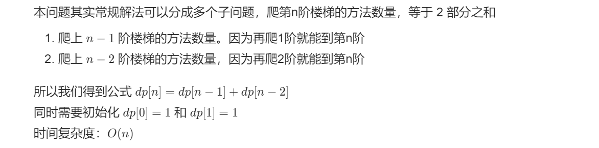

# 70. 爬楼梯

## 题目

难度: 简单

假设你正在爬楼梯。需要 n 阶你才能到达楼顶。

每次你可以爬 1 或 2 个台阶。你有多少种不同的方法可以爬到楼顶呢？

**示例 1：**

```
输入：n = 2
输出：2
解释：有两种方法可以爬到楼顶。
1. 1 阶 + 1 阶
2. 2 阶
```

**示例 2：**

```
输入：n = 3
输出：3
解释：有三种方法可以爬到楼顶。
1. 1 阶 + 1 阶 + 1 阶
2. 1 阶 + 2 阶
3. 2 阶 + 1 阶

```

**提示：**

- 1 <= n <= 45

来源: 力扣（LeetCode）
链接: <https://leetcode.cn/problems/climbing-stairs/>
著作权归领扣网络所有。商业转载请联系官方授权，非商业转载请注明出处。

## 思路



变式题，如果每次可以爬 1、2或者3 阶楼梯，那么有：
$$
dp[n] = dp[n - 1] + dp[n - 2] + dp[n - 3]
$$

## 答案

### 1. 动态规划

```c++
class Solution {
public:
    int climbStairs(int n) {
        // 动态规划一般都需要处理特殊情况
        if (n == 1) {
            return 1;
        }

        // dp[i] 表示爬到 i 有多少中方法
        std::vector<int> dp(n + 1);

        dp[1] = 1;
        dp[2] = 2;

        for (int i = 3; i <= n; i++) {
            // 每个位置都可以从爬两步或者爬一步得到
            dp[i] = dp[i - 1] + dp[i - 2];
        }

        return dp[n];
    }
};
```

### 2. 使用临时遍历优化空间复杂度

```c++
class Solution {
public:
    int climbStairs(int n) {
        // 动态规划一般都需要处理特殊情况
        if (n <= 2) {
            return n;
        }

        int res;
        int prev_prev = 1;
        int prev = 2;

        for (int i = 3; i <= n; i++) {
            res = prev_prev + prev;
            prev_prev = prev;
            prev = res;
        }

        return res;
    }
};
```

### 3. 使用环形数组优化空间复杂度常数

```c++
class Solution {
public:
    int climbStairs(int n) {
        // 动态规划一般都需要处理特殊情况
        if (n <= 2) {
            return n;
        }

        std::vector<int> dp(2);
        dp[0] = 1;
        dp[1] = 2;

        for (int i = 3; i <= n; i++) {
            dp[(i - 1) % 2] = dp[(i - 2) % 2] + dp[(i - 3) % 2];
        }

        return dp[(n - 1) % 2];
    }
};
```
