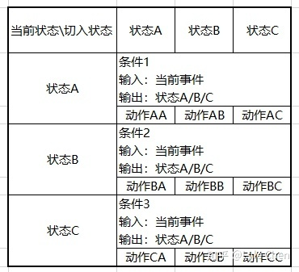

# 有限状态机

## **运行机制**

基于对有限状态机的粗浅理解，大体的运行机制为：

* 系统所处的状态是明确并且有限的，必定属于状态全集中的某一种；
* 系统接受输入，根据判定条件，决定是维持当前状态，还是切换到某一个新的状态；
* 在维持或切换的过程中，执行一些预设的操作。

可以认为有限状态机是一个离散系统，每接受一次输入，进行一次判断和切换。

## 所含要素

一个有限状态机包含如下几个要素：

* **状态**：系统所处的状态，在运行过程中又可以分为**当前状态**和**下一阶段状态**；
* **事件**：也可以理解为每一次运行的输入；
* **条件**：根据输入事件执行的判定条件，条件是基于状态的，当前所处的每一种状态，都可以有自己对应的一套判定条件，来决定下一步进入哪一种状态；
* **动作**：确定切换路径后，执行的附加操作。

> 以一个共 3 种状态的 FSM 为例，共有 3 套判定条件，根据当前所处的状态来确定使用哪一种判定条件，共有 3*3=9 种动作，决定每一种状态切换过程中需要执行的动作。

## 分析方法

通常可以用一个表格来对所处理的 FSM 进行分析，防止情况的遗漏。



在表格中分析清楚每一种状态切换的判定条件和执行动作，再用代码实现，可以最大程度地减轻思考的难度，减少错误的概率。

## 代码实现

以 OOP 的方式，做了一个基础的 Python 实现。

**FSM基类**：

```python
class StateMachine:
    def __init__(self, cfg, states, events_handler, actions_handler):
        # config information for an instance
        self.cfg = cfg
        # define the states and the initial state
        self.states = [s.lower() for s in states]
        self.state = self.states[0]
        # process the inputs according to current state
        self.events = dict()
        # actions according to current transfer 
        self.actions = {state: dict() for state in self.states}
        # cached data for temporary use
        self.records = dict()
        # add events and actions
        for i, state in enumerate(self.states):
            self._add_event(state, events_handler[i])
            for j, n_state in enumerate(self.states):
                self._add_action(state, n_state, actions_handler[i][j])

    def _add_event(self, state, handler):
        self.events[state] = handler

    def _add_action(self, cur_state, next_state, handler):
        self.actions[cur_state][next_state] = handler

    def run(self, inputs):
        # decide the state-transfer according to the inputs
        new_state, outputs = self.events[self.state](inputs, self.states, self.records, self.cfg)
        # do the actions related with the transfer 
        self.actions[self.state][new_state](outputs, self.records, self.cfg)
        # do the state transfer
        self.state = new_state
        return new_state

    def reset(self):
        self.state = self.states[0]
        self.records = dict()
        return

# handlers for events and actions, event_X and action_XX are all specific functions
events_handlers = [event_A, event_B]
actions_handlers = [[action_AA, action_AB],
                    [action_BA, action_BB]]

# define an instance of StateMachine
state_machine = StateMachine(cfg, states, events_handlers, actions_handlers)
```

如果对于状态机有具体的要求，可以继承这个基类进行派生。

比如，有对状态机分层嵌套的需求。

```python
class StateGeneral(StateMachine):
    def __init__(self, cfg, states):
        super(StateGeneral, self).__init__(cfg, states, events_handler, actions_handler)
        self.sub_state_machines = dict()

    def add_sub_fsm(self, name, fsm):
        self.sub_state_machines[name] = fsm

    def run(self, inputs):
        new_state, outputs = self.events[self.state](inputs, self.states, self.records, self.cfg)
        # operate the sub_state_machines in actions
        self.actions[self.state][new_state](outputs, self.records, self.cfg, \
                 self.sub_state_machines)
        self.state = new_state
        return new_state

    def reset(self):
        self.state = self.states[0]
        self.records = dict()
        for _, sub_fsm in self.sub_state_machines.items():
            sub_fsm.reset()
        return
```

## Reference

[1] <https://zhuanlan.zhihu.com/p/337806291>
