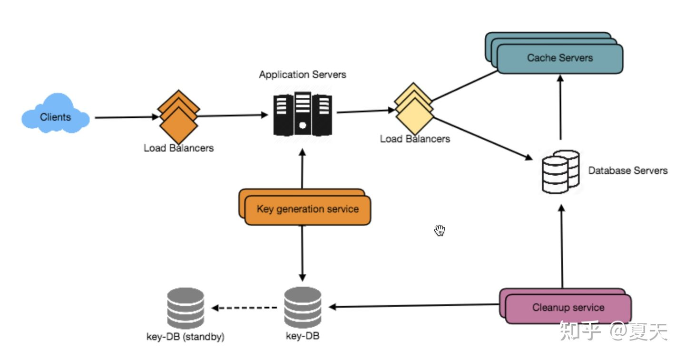

# 短链接服务设计

## 完整系统设计方案



## 前置知识

### 1. Base64编码

Base64 是二进制到字符编码的一种方案，每个 Base64 数字可以表示一个 6 比特的数据，因此 3 个字节（即 24 B）可以被表示为 4 个 Base64 数字。

Base64 编码表如下：

| 数字  | Base64 编码    |
| ----- | -------------- |
| 0~25  | ASCII 字符 A~Z |
| 26~51 | ASCII 字符 a~z |
| 52~61 | ASCII 字符 0~9 |
| 62    | ASCII 字符 +   |
| 63    | ASCII 字符 /   |

因为 Base64 是每 6 个比特进行一次编码，而现代电脑上的编码值被分为了一个个 8 比特的字节，因此在 Base64 编码的文本中，每 4 个字符表示 3 个字节的未编码的文本或数据。这就意味着 当未编码的输入字节数不是 3 的倍数时，编码输出必须加上缀词（padding）来使得输出的长度是 4 的倍数，这个缀词就是 `=`，它表明不再需要更多的比特来进行解码。

* 当源数据的字节数是 3 的倍数，则不需要加 `=`
* 当源数据的字节数除 3 余 1，则加两个 `=`
* 当源数据的字节数除 3 余 2，则加一个 `=`

### 2. MD5算法

 MD5 算法是一种被广泛使用的密码散列函数，可以产生出一个128位（16 字节）的散列值（hash value），用于确保信息传输完全一致。

### 3. 一致性哈希算法

#### 3.1 传统 hash 算法存在的问题

假设有一个由 A、B、C 三个节点组成的 KV 服务，每个节点存放不同的 KV 数据。通过哈希算法，每个 key 都可以寻址到对应的服务器。例如查询 key 是 key-01，计算公式为 `hash(key-01) % 3`，经过计算寻址到了编号为 1 的服务器结点 A。


但如果服务器数量发生变化，基于新的服务器数量来执行哈希算法的时候，就会出现路由寻址失败的情况，Proxy 无法找到之前寻址到的那个服务器节点。

假如 3 个节点不能满足业务需求了，这时增加了一个节点，节点的数量从 3 变化为 4，那么之前的`hash(key-01)%3=1` 就变成了`hash(key-01)%4=X`，因为取模运算发生了变化，所以这个X大概率不是1（假设是2），这时再查询就会找不到数据了，因为key-01对应的数据存储在节点A上


同样的道理，如果需要下线 1 个服务器节点也存在类似的问题。

#### 3.2 传统 hash 的解决方法

而解决这个问题的办法，在于要迁移数据，基于新的计算公式 `hash(key-01)%4` 来重新对数据和节点做映射。数据的迁移成本是非常高的。

#### 3.3 一致性 hash 算法

哈希算法是对节点的数量进行取模运算，而一致性哈希是对 $$2 ^ {32}$$ 进行取模运算。一致性哈希将整个哈希值空间组成一个虚拟的圆环，也就是哈希环：


哈希环的空间按照顺时针方向组织，圆环的正上方的点代表 0，0 点右侧的第一个点代表 1，以此类推直到 $$2^{32} - 1$$，也就是说 0 点左侧的第一个点代表 $$2^{32} - 1$$。

在一致性哈希中，通过执行哈希算法，将节点映射到哈希环上。假设哈希算法函数为 `c-hash()`，比如选择节点的主机名作为参数执行 `c-hash()`，每个节点就能确定其在哈希环上的位置：


当需要对指定key的值进行读写的时候，通过下面2步进行寻址：

1. 将 key 作为参数执行 c-hash() 计算哈希值，并确定此 key 在环上的位置
2. 从这个位置沿着哈希环顺时针走，遇到的第一个节点就是 key 对应的节点

假设 key-01、key-02、key-03 三个 key，经过哈希算法 c-hash() 计算后，在哈希环上的位置如下图：


根据一致性 hash 算法，key-01 将寻址到节点 A，key-02 将寻址到节点 B，key-03 将寻址到节点C。

#### 3.4 一致性哈希算法如何解决传统哈希算法问题

假设，现在节点C故障了：


可以看到，key-01 和 key-02 不会受到影响，只有 key-03 的寻址被重定位到 A。

**在一致性哈希算法中，如果某个节点宕机不可用了，那么受影响的数据仅仅是会寻址到此节点和前一节点之间的数据**。比如当节点C宕机了，受影响的数据是会寻址到节点 B 和节点 C 之间的数据（例如 key-03 ），寻址到其他哈希环空间的数据不会受到影响。

如果需要扩容一个节点：


可以看到，key-01、key-02不受影响，只有key-03的寻址被重定位到新节点D。**在一致性哈希算法中，如果增加一个节点，受影响的数据仅仅是会寻址到新节点和前一节点之间的数据**。

使用了一致哈希算法后，扩容或缩容的时候，都只需要重定位环空间中的一小部分数据。也就是说，**一致哈希算法具有较好的容错性和可扩展性**。

**当节点数越多的时候，使用哈希算法时，需要迁移的数据就越多，使用一致哈希时，需要迁移的数据就越少**。

#### 3.5 一致性哈希算法节点太少分布不均匀

在一致性哈希算法中，如果节点太少，容易因为节点分布不均匀造成数据访问的冷热不均，也就是说大多数访问请求都会集中少量几个节点上：


上图中，虽然有 3 个节点，但访问请求主要集中在节点 A 上。

通过引入虚拟节点解决分布不均匀的问题。对每一个服务器节点计算多个哈希值，每个计算结果位置上都放置一个虚拟节点，并将虚拟节点映射到实际节点。比如，可以在主机名后面增加编号，分别计算Node-A-01、Node-A-02、Node-B-01、Node-B-02、Node-C-01、Node-C-02的哈希值，于是形成 6 个虚拟节点。


增加了节点后，节点在哈希环上的分布就相对均匀了。如果有访问请求寻址到 Node-A-01 这个虚拟节点，将被重定位到节点 A。

## 前言

### 1. 什么是短链接

举个例子，普通的链接如下：

```
https://blog.csdn.net/zhiyikeji/article/details/123957845?spm=1001.2014.3001.5501
```

当我们需要将这个链接放在文章或者推广给别人的时候，就会显得这个链接又臭又长。而短链接的出现就是用一个很短的 URL 来替代这个很长的链接，当用户访问短链接的时候就会重定向到之前的链接。

短链接如下：

```
sourl.cn/AmBh9B
```

### 2. 为什么需要 URL 短链接

> 问题在于短链接的本质就是**重定向**，为什么我们还需要弄个短链接呢？

短链接用于为长 URL 创建较短的别名，我们称这些缩短的别名为 “短链接”。

当用户点击这些短链接时就会被重定向到原始 URL。

### 3. 短链接的优势

* **节省空间**：短链接在显示、打印和发送消息时可以节省大量空间
* **业务分析**：URL 缩写经常用于优化设备之间的链接、跟踪单个链接以分析受众、衡量广告活动的表现，或隐藏关联的原始 URL

## 系统要求和目标

无论在开发任何系统或者功能时，我们应该先要确定系统的定位和要达到的目标。

### 1. 功能要求

* 给定一个 URL 时，我们的服务应该为其生成一个较短且唯一的别名，这叫做短链接
* 当用户访问短链接时，我们的服务应该将他们重定向到原始链接
* 用户应该能够选择性地为他们的 URL 选择一个自定义的短链接
* **链接可以在指定时间跨度之后过期**，用户应该能够指定过期时间

### 2. 非功能要求

* 高可用：系统必须**高可用**，如果我们的服务关闭，所有 URL 重定向都将失效
* 耗时短：URL **重定向的延迟情况**应该足够小
* 不可推测：短链接应该是**不可以推测**的

### 3. 用户体验优化

* 支持分析和统计，比如短链接的访问次数
* 其他服务也应该可以通过 RESTAPI 访问我们的服务

## 容量要求和限制

我们的系统将会有很大的并发量，会有对短链接的读取请求和创建短链接的写入请求。

假设读写比例是 100 : 1。

### 1. 访问量估计

假设我们每个月都有 5 亿个新增短链接，读写比例为 100 : 1，我们预计在同一时间内有 500 亿重定向：

$$ 100 * 5 亿= 500 亿$$

我们系统的 QPS （即每秒的新短链接）：

$$5 亿 / (30 天 * 24 小时 * 3600 秒) \approx 200 $$

### 2. 存储估计

假设我们将每个 URL 缩短请求（以及相关的缩短链接）存储 5 年，由于我们预计每个月将有 5 亿个新 URL，因此我们预计存储的对象总数为 300 亿：

$$5 亿 * 5 年 * 12 月 = 300 亿$$

假设每个存储的对象大约有 500 个字节，我们将需要 15 TB 的总存储。

$$ 300 亿 * 500 bytes \approx 15 TB$$

### 3. 带宽估计

对于写请求，由于我们预计每秒有 200 个新的短链接创建，因此我们服务的总传入数据为每秒 100 KB：

$$ 200 * 500 bytes \approx 100 KB / s$$

对于读请求，预计每秒约有 20000 个 URL 重定向，因此我们服务的总传出数据为每秒 10 MB：

$$20000 * 500 bytes = 10 MB / s$$

### 4. 内存预估

对于一些热门的 URL 为了提高访问速度，我们需要进行缓存。

根据二八原则，即 20% 的URL 产生 80% 的流量。

假设我们每秒有 20000 个请求，因此我们每天将收到 17 亿个请求：

$$ 20000 * 24 * 3600 \approx 17 亿$$

要缓存这些请求中的 20%，我们最多需要 170 GB 的内存：

$$ 17 亿 * 0.2 * 500 bytes \approx 170 GB$$

> 由于有很多相同 URL 的重复请求，因此我们的实际内存使用量可能达不到 170 GB。

### 5. 总结

整体来说，假设每月新增5亿个URL，读写比为100：1，我们的预估数据大概是下面这样：

## 系统 API 设计

### 1. 创建短链接接口

```java
    /**
     * 创建短链接
     *
     * @param api_dev_key  分配给注册用户的开发者密钥，可以根据该值对用户的创建短链接数量进行限制；
     * @param original_url 需要生成短链接的原始URL
     * @param custom_alias 用户对于URL自定义的名称（默认为空）
     * @param user_name    可以用在编码中的用户名（默认为空）
     * @param expire_date  短链接的过期时间（单位：秒）
     * @return 成功生成短链接将返回短链接URL；否则，将返回错误代码。
     */
    public String createURL(String api_dev_key, String original_url, String custom_alias, String user_name, Long expire_date) 
```

### 2. 删除短链接

```java
    /**
     * 删除短链接接口
     *
     * @param api_dev_key 分配给注册用户的开发者密钥
     * @param url_key     要删除的短链接字符串
     * @return 成功删除将返回delete success
     */
    public String deleteURL(String api_dev_key, String url_key);
```

## 恶意访问控制

我们可以用 `api_dev_key` 来限制用户以防止接口滥用。

每个`api_dev_key`可以限制为每段时间创建一定数量的 URL 和重定向（可以根据开发者密钥设置不同的持续时间）。

## 数据库设计

我们在选择使用哪一种数据库之前，我们需要根据数据的特性来设计。

在我们的短链接服务系统中的数据，存在以下特点：

* 需要存储十亿条数据揭露
* 存储的每个对象都很小（小于 1 K）
* 除了存储哪个用户创建了 URL 外，记录之间没有任何关系
* 我们的服务有大量的读取请求（相比于写请求而言）

关系型数据的设计类图如下：


我们可以看到 url 和 user 表之间没有更复杂的联系，同时我们的 URL 链接以亿为单位，所以传统的关系型数据库就不再适用，可以考虑 nosql，如 key-value 数据库：redis 和 mongodb 等。或者直接列数据库 hive、hbase 等大数据家族里的数据库。

## 系统基本设计与算法

我们接下来需要首先解决的问题就是如何为给定的 URL 生成一个简短且唯一的密钥，目前主要有两种解决方案：

* 对原 URL 进行编码
* 提前离线生成密钥

### 1. 对原 URL 进行编码【淘汰】

#### 1.1 基本思路（MD5 + Base64编码）

我们可以使用 MD5 或者 SHA256 计算原始 URL 的唯一哈希值，之后再对哈希散列进行编码，我们使用 MD5 作为哈希函数。

> 编码方式可以是 base36([a~z, 0~9])或者 base62([A~Z, a-z, 0~9])，如果需要使用 `+`与  `/`，则需要使用 Base64 编码，**我们这里使用 base64 编码**。

使用 Base64 编码，6个字符的长密钥将产生 $$64 ^ 6 \approx 687 亿$$个可能的字符串，，8 个字符的长密钥将产生 $$64^8 \approx 281 万亿$$ 个可能的字符串。

> 我们假设 6 个字母的键已经满足我们的需求。

MD5 产生的哈希值有 128 位（16 字节），每个 base64 字符可以编码 6 位哈希值（$$64 = 2^6$$），因此 128 位哈希值进行 Base64 编码会得到一个超过 21 个字符的字符串。

由于短链接只有 6 个字符，因此我们可以用编码字符的前 6 位作为密钥。**这样会导致重复密钥，为了解决这个问题，我们可以选择编码字符串中的其他字符或者交换一些字符。**

#### 1.2 算法缺陷

我们的方案存在以下两个问题：

1. 不同用户输入相同的 URL 时，可能获得相同的短链接， 这是不能接受的
2. 未考虑 URL 中的一部分经过编码的问题

#### 1.3 解决方案

当用户输入相同的 URL（包括不同的用户输入相同 URL 以及相同用户输入部分编码后的 URL）时，我们可以**在每个原始 URL 后增加一个递增的序列化使其唯一**，然后生成一个哈希值。在存储时不需要存储添加到尾部的序列号。

注意这种方案需要控制不断递增的序列号不溢出，而且另外增加序列号会影响服务的性能。

另一个解决方法时将用户 ID（唯一）附加到原始 URL 中。如果用户未登录，则需要为用户生成唯一密钥，如果生成密钥之后仍然存在重复链接，需要继续生成密钥，直到获得唯一的短链接。

### 2. 生成离线密钥【选择】

可以有一个独立的密钥生成服务，我们将它叫做 KGS（Key Generation Service），它预先生成随机的 6 个字母的字符串，并将它们存储在数据库中。

每当我们需要生成短链接时，都去 KGS 获取一个已经生成的密钥并使用。这种方法更加简单快捷，我们不仅不需要对 URL 进行编码，而且也不担心重复或者冲突，KGS 将确保插入到数据库中的所有密钥都是唯一的。

#### 2.1 并发问题

密钥一旦使用，就应该在数据库中进行标记，以确保不会再次使用。如果有多个服务器同时读取密钥，我们可能会遇到两个或多个服务器同时从数据库读取相同密钥的情况。

如何解决这个并发问题呢？

KGS 可以使用两个表来存储密钥：

* 一个表存储尚未使用的密钥
* 一个表存储所有已使用的密钥

一旦KGS将密钥提供给其中一个服务器，它就可以将它们移动到已使用的秘钥表中；可以始终在内存中保留一些密钥，以便在服务器需要时快速提供它们。

如果在将所有加载的密钥分配给某个服务器之前KGS重启或死亡，我们将浪费这些密钥，考虑到我们拥有的秘钥很多，这种情况也可以接受。

还必须确保KGS不将相同的密钥提供给多个服务器，因此，KGS将秘钥加载到内存和将秘钥移动到已使用表的动作需要时同步的，或者加锁，然后才能将秘钥提供给服务器。

#### 2.2 单点故障问题

由于我们的密钥依赖于数据库，所以一旦数据库服务器宕机，就会直接导致我们的服务不可用。

对于这种问题，我们可以从两个方面去解决：

1. 害怕数据库宕机，我们可以考虑弄一个备库或者直接做一个数据库集群
2. 我们可以提前将一批密钥加载到缓存，加载的位置推荐是分布式缓存，以保证即使数据库不可用，也能提供一段时间的密钥服务

### 3. 如何完成密钥的查找

我们可以在数据库中查找密钥以获得完整的 URL：

* 如果它存在于数据库中，则向浏览器发回一个`HTTP 302 Redirect`状态，将存储的 URL 传递到请求的 Location 字段中
* 如果密钥不在我们系统中，则发出 `HTTP 404 Not Found`状态或将用户重定向回主页

## 数据分区和复制

由于我们存储的 URL 数以亿计，那么一个数据库结点在存储上可能不满足要求，并且单节点也不能支撑我们读取的要求。

因此我们需要开发一种分区方案，将数据划分并存储到不同的数据库服务中。

### 1. 基于范围分区

我们可以根据短链接的第一个字母将 URL 存储在不同的分区中。

即我们将所有以字母 `A/a` 开头的 URL 保存在一个分区中，将所有以字母 `B/b` 开头的 URL 保存在另一个分区中，以此类推。

这种方法被称为基于范围的分区，我们设置可以将某些不太频繁出现的字母合并到一个数据库分区中。

### 2. 基于 Hash 分区

在此方案中，我们对要存储的对象进行 Hash 计算。然后，我们根据Hash结果计算使用哪个分区。在我们的例子中，我们可以使用短链接的 Hash 值来确定存储数据对象的分区。

Hash 函数会将 URL 随机分配到不同的分区中（例如，Hash 函数总是可以将任何 key 映射到 `[1…256]` 之间的一个数字，这个数字将表示我们在其中存储对象的分区。

这种方式有可能导致有些分区数据超载，可以使用**一致性哈希算法**解决。

同时我们只依赖于数据库，也无法解决实际应用的问题，下面我们引入缓存，进行热点数据的存储。

## 缓存

对于频繁访问的链接我们可以先加载到缓存，在我们通过密钥获取访问链接时先从 redis 获取，如果不能够获取的到再去访问数据库，在一定程度上缓解数据库压力，同时提高系统响应速度。

### 1. 缓存容量

那么我们缓存多少数据呢？

可以从每天 20% 的流量开始，并根据客户端的使用模式调整所需的缓存服务器数量。如上所述，我们需要 170 GB 内存来缓存 20% 的日常流量。

可以使用几个较小的服务器来存储所有这些热门 URL。但是缓存会有一个界限，同时当时设置成的热点数据可能过一段时间热度就没了，怎么办呢，此时引入我们的缓存淘汰策略。

### 2. 缓存淘汰策略

我们以 redis 为例：

* volatile-Iru:从已设置过期时间的数据集(server.db[ i].expires)中挑选最近最少使用的数据淘汰
* volatile-ttl:从已设置过期时间的数据集(server.db[ i].expires）中挑选将要过期的数据淘汰
* volatile-random:从已设置过期时间的数据集(server.db[ i].expires）中任意选择数据淘汰
* allkeys-lru:从数据集(server.db[ i].dict)中挑选最近最少使用的数据淘汰
* allkeys-random:从数据集(server.db[ i].dict)中任意选择数据淘汰
* no-enviction(驱逐)∶禁止驱逐数据

很明显我们的过期时间不可能设置的很短，所以我们只能选取allkeys-lru策略，即从数据集(server.db[i].dict)中挑选最近最少使用的数据淘汰。

### 3. 如何更新缓存

每当出现缓存未命中时，我们的服务器都会命中后端数据库。每次发生这种情况，我们都可以更新缓存并将新条目传递给所有缓存副本。每个副本都可以通过添加新条目来更新其缓存。如果副本已经有该条目，它可以简单地忽略它。

你以为缓解了数据库的访问压力，提高了访问速度就结束了吗？

对于高并发，大数据量的系统设计，我们不可能使用单一的服务体系，即将所有的服务只部署在一台服务器上，无论是数据库，还是缓存，还是我们的服务都应该以集群的方式部署，那么对于服务集群的命中应当如何去选取呢？

没错，我们可以使用负载均衡策略。

## 负载均衡

首先我们需要确定在哪些地方部署负载均衡？

### 1. 负载均衡的位置选取

可以在系统中的三个位置添加负载均衡层：

* 在客户端和应用程序服务器之间
* 在应用程序服务器和数据库服务器之间
* 在应用程序服务器和缓存服务器之间

### 2. 负载均衡策略

可以使用简单的循环调度方法，在后端服务器之间平均分配传入的请求。这种负载均衡方式实现起来很简单，并且不会带来任何开销。此方法的另一个好处是，如果服务器死机，负载均衡可以让其退出轮换，并停止向其发送任何流量。

循环调度的一个问题是没有考虑服务器过载情况。因此，如果服务器过载或速度慢，不会停止向该服务器发送新请求。要处理此问题，可以放置一个更智能的解决方案，**定期查询后端服务器的负载并基于此调整流量**。

完成以上设计之后，我们还需要面临最后一个问题，就是数据是不是需要永久保留呢？

## 数据清除策略

数据应该永远保留，还是应该被清除？如果达到用户指定的过期时间，短链接应该如何处理？

我们给出两种解决方案：

* 持续扫描数据库，清除过期数据
* 懒惰删除策略

如果我们选择持续查询过期链接来删除，将会给数据库带来很大的压力；可以慢慢删除过期的链接，并进行懒惰的方式清理。服务确保只有过期的链接将被删除，尽管一些过期的链接可以在数据库保存更长时间，但永远不会返回给用户。

* 每当用户尝试访问过期链接时，我们都可以删除该链接并向用户返回错误
* 单独的清理服务可以定期运行，从存储和缓存中删除过期的链接
* 此服务应该非常轻量级，并计划仅在预期用户流量较低时运行
* 我们可以为每个短链接设置默认的到期时间（例如两年）
* 删除过期链接后，我们可以将密钥放回KGS的数据库中重复使用

## Reference

[1] <https://blog.csdn.net/qq_40378034/article/details/117870061>

[2] <https://zhuanlan.zhihu.com/p/489994597>
