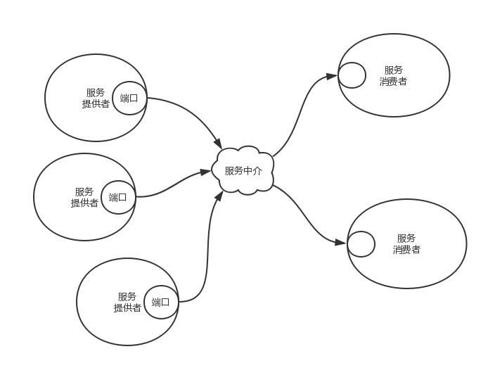
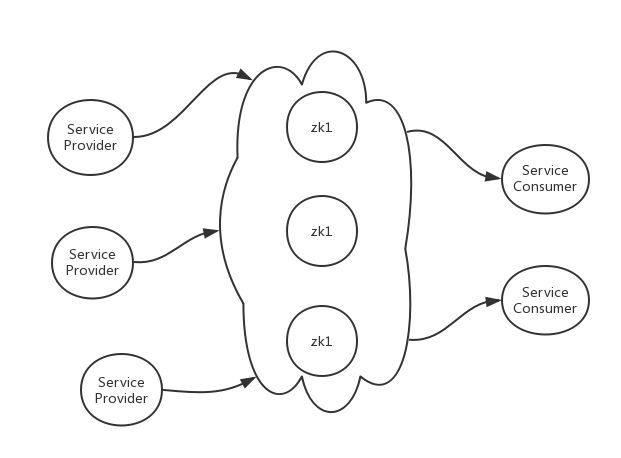
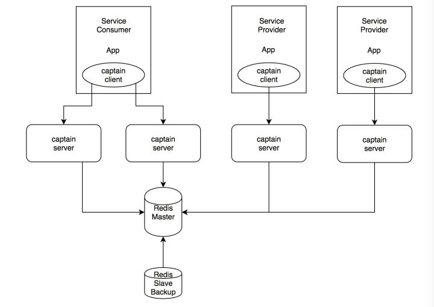

# 服务发现

## 简介

服务发现有三个角色，服务提供者、服务消费者和服务中介。

* 服务中介是联系服务提供者和服务消费者的桥梁。服务中介提供多个服务，每个服务对应多个服务提供者。
* 服务提供者将自己提供的服务地址注册到服务中介
* 服务消费者从服务中介那里查找自己想要的服务的地址，然后享受这个服务。

服务中介就是一个字典，字典里有很多key/value键值对，key是服务名称，value 是服务提供者的地址列表。服务注册就是调用字典的Put方法塞东西，服务查找就是调用字典的 Get 方法拿东西。

* 当服务提供者节点挂掉时，要求服务能够及时取消注册，以便及时通知消费者重新获取服务地址。
* 当服务提供者新加入时，要求服务中介能及时告知服务消费者，你要不要尝试一下新的服务。

## Redis 作为服务中介

### 1. 实现

Redis里面有丰富的数据结构，拿来存储服务字典再合适不过了。对每一个服务名称，我们用一个set结构存储服务的IP:Port字符串。如果服务提供者加入，调用sadd命令加入服务地址，如果服务挂掉，调用srem命令移除服务地址。

对服务消费者使用smembers指令获取所有服务地址然后在消费进程里随机挑一个，或者使用srandmemember指令直接获取随机服务地址。

### 2. 问题

这个时候你也许会表示怀疑，服务发现真这么简单么？答案是还差一点，关于上面的这个解决方案有几个问题。

**第一个问题：服务提供者进程如果被kill -9暴力杀死，不能主动调用srem命令怎么办？**

这个时候服务列表中多了一个黑地址指向了不存在的服务而消费者完全不知道，这个时候服务中介就成了黑中介了。那该怎么办呢？

我们引入**服务保活和检查机制**，并更换数据结构。服务提供者需要每隔5秒左右向服务中介汇报存活，服务中介将服务地址和汇报时间记录在zset数据结构的value和score中。服务中介需要每隔10秒左右检查zset数据结构，踢掉汇报时间严重落后的服务地址项。这样就可以准实时地保证服务列表中服务地址的有效性。

**第二个问题是服务列表变动时如何通知消费者。有两种解决方案。**

**第一种是轮询**，消费者需要每隔几秒查询服务列表是否有改变。如果服务很多，服务列表很大，消费者很多，redis会有一定压力。所以这时候可以**引入服务列表的版本号机制**，给每个服务提供一个key/value设置服务的版本号，就是在服务列表发生变动时，递增这个版本号。消费者只需要轮询这个版本号的变动即可知道服务列表是否发生了变化。因为服务列表比较稳定，仅在网络严重抖动的情况下才会频繁发生变动，所以redis几乎没有压力。

**第二种是采用pubsub**。这种方式及时性要明显好于轮询。**缺点是每个pubsub都会占用消费者一个线程和一个额外的redis连接**。为了减少对线程和连接的浪费，我们使用单个pubsub广播全局版本号的变动。所谓全局版本号就是任意服务列表发生了变动，这个版本号都会递增。接收到版本变动的消费者再去检查各自的依赖服务列表的版本号是否发生了变动。这种全局版本号也可以用于第一种轮询方案。

**第三个问题是redis是单点的，如果挂掉了怎么办？**

这是个大问题。正是因为这个问题的存在，流行的服务发现系统都是使用分布式数据库zookeeper/etcd/consul等来作为服务中介，它们是分布式的多节点的，挂掉了一个节点没关系，系统仍然可以正常工作。

那如果整个zk集群挂掉会怎样呢？其实每个服务消费者在本地内存里都会存一份当前的服务列表，即使服务中介集群挂掉，也是可以使用当前的服务列表正常工作的。

那redis作为服务中介就真的不靠谱了么？其实还有个redis-sentinel可以消除redis的单点问题，redis-sentinel可以在主节点挂掉的时候，自动升级从节点为主节点。所以拿redis干这件事也是可以的。用redis干服务发现确实非常简单，虽然这种方式非常不流行。

## 服务提供者不只是http服务

上面提到服务提供者简单来说就是HTTP服务器，其实服务多种多样。可以是数据库服务，可以是RPC服务，可以是UDP服务等等。

如果是MySQL数据库，那如何将MySQL服务注册到服务中介呢？原生的MySQL可没有提供这样功能。一般做法是提供一个Agent代理去注册。这个代理除了将服务地址注册到服务中介外，还需要监控MySQL的健康状况，以便当MySQL宕机时能及时切换到新的MySQL服务地址。一般这个Agent为了节省资源而不止监控一个数据库，它可以同时监控多个数据库，甚至是多种数据库。

## **服务配置重加载**

服务发现一般只是用来注册和查找服务列表这样一个比较单纯的功能。不过现代的服务发现系统还会集成服务配置管理功能。这样可以实现服务配置的实时重加载。原理也很简单，就是对于每一个服务项，服务中介还会存储一个单独的key/value用来存储这个服务的配置信息。当这个配置项在后台被修改时，服务中介会实时通知相关服务器变更配置信息。比如数据库地址变动，业务参数修改等。

## **服务管理后台**

为了便于服务管理，一般服务发现还会提供一个服务管理后台，用于管理人员查看服务集群的状态。如果服务注册和汇报时提供冗余的配置信息，服务管理后台就可以呈现更为详细的服务信息。服务管理后台还可以将所有的服务依赖组织起来，呈现出一颗漂亮的服务依赖树。

## 服务发现的简单实现

小编在闲暇之余基于Redis实现了一个简单的服务发现系统[Captain](https://link.zhihu.com/?target=https%3A//github.com/pyloque/captain)。读者可以去github上下载这个项目进行学习。我除了编写了服务发现的服务器之外，客户端sdk也一块做了开发，可能不太稳定，希望读者体谅，不要用于线上的业务系统。

