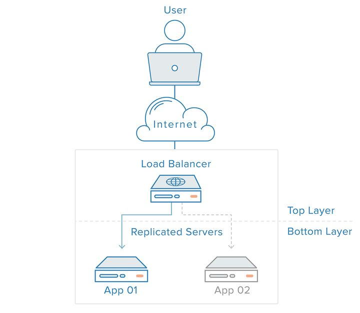
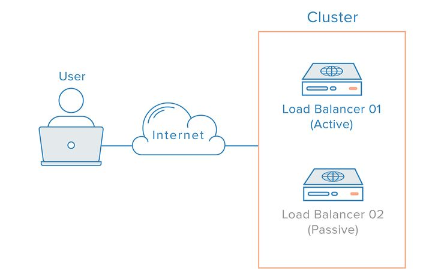
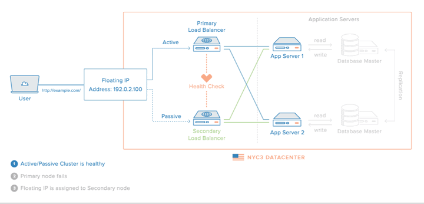

# 负载均衡

## 简介

负载均衡是高可用网络基础架构的关键组件，通常用于将工作负载分布到多个服务器来提高网站、应用、数据库或其他服务的性能和可靠性。

一个没有负载均衡的 web 架构类似下面这样：

在这里用户是直连到 web 服务器，如果这个服务器宕机了，那么用户自然也就没办法访问了。另外，如果同时有很多用户试图访问服务器，超过了其能处理的极限，就会出现加载速度缓慢或根本无法连接的情况。

而通过在后端引入一个负载均衡器和至少一个额外的 web 服务器，可以缓解这个故障。通常情况下，所有的后端服务器会保证提供相同的内容，以便用户无论哪个服务器响应，都能收到一致的内容。

从图里可以看到，用户访问负载均衡器，再由负载均衡器将请求转发给后端服务器。在这种情况下，单点故障现在转移到负载均衡器上了。这里又可以通过引入第二个负载均衡器来缓解，但在讨论之前，我们先探讨下负载均衡器的工作方式。

## 负载均衡处理的请求

负载均衡器的管理员能主要为下面四种主要类型的请求设置转发规则：

- HTTP
- HTTPS
- TCP
- UDP

## 负载均衡如何选择转发的后端服务器

负载均衡器一般根据两个因素来决定要将请求转发到哪个服务器。首先，确保所选择的服务器能够对请求做出响应，然后根据预先配置的规则从健康服务器池（healthy pool）中进行选择。

因为，负载均衡器应当只选择能正常做出响应的后端服务器，因此就需要有一种判断后端服务器是否「健康」的方法。为了监视后台服务器的运行状况，运行状态检查服务会定期尝试使用转发规则定义的协议和端口去连接后端服务器。如果，服务器无法通过健康检查，就会从池中剔除，保证流量不会被转发到该服务器，直到其再次通过健康检查为止。

## **负载均衡算法**

负载均衡算法决定了后端的哪些健康服务器会被选中。几个常用的算法：

- **Round Robin（轮询）：**为第一个请求选择列表中的第一个服务器，然后按顺序向下移动列表直到结尾，然后循环。
- **Least Connections（最小连接）：**优先选择连接数最少的服务器，在普遍会话较长的情况下推荐使用。
- **Source：**根据请求源的 IP 的散列（hash）来选择要转发的服务器。这种方式可以一定程度上保证特定用户能连接到相同的服务器。

如果你的应用需要处理状态而要求用户能连接到和之前相同的服务器。可以通过 Source 算法基于客户端的 IP 信息创建关联，或者使用粘性会话（sticky sessions）。

## 负载均衡器集群

最后，想要解决负载均衡器的单点故障问题，可以将第二个负载均衡器连接到第一个上，从而形成一个集群。

当主负载均衡器发生了故障，就需要将用户请求转到第二个负载均衡器。因为 DNS 更改通常会较长的时间才能生效，因此需要能灵活解决 IP 地址重新映射的方法，比如浮动 IP（floating IP）。这样域名可以保持和相同的 IP 相关联，而 IP 本身则能在服务器之间移动。

一个使用浮动 IP 的负载均衡架构示意图：

## Reference

[1] <https://zhuanlan.zhihu.com/p/32841479>
