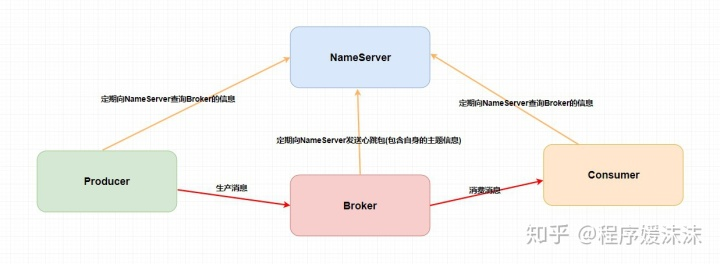

# 消息队列

## 作用

> 消息队列可以起到**异步、解耦、削峰**的作用，这六个字不仅是消息队列的精华，更是编程和架构的精华。

假设我们需要设计一个购票系统，需求时在用户购买完后能收到购买完成的短信。

假设购票系统处理需要 150 ms，短信系统处理需要 200 ms， 那么整个流程就需要 350 ms。

如果再加上邮件系统，耗时就会变得更长。

### 1. 异步

我们可以在将消息存入消息队列后就直接返回，整个耗时就变成了 150 ms + 10 ms = 160 ms。

### 2. 解耦

回到最初同步调用的过程，我们写个伪代码简单概括一下。

那么第二步，我们又添加了一个发送邮件，我们就得重新去修改代码，如果我们又加一个需求：用户购买完还需要给他加积分，这个时候我们是不是又得改代码？

如果你觉得还行，那么我这个时候不要发邮件这个服务了呢，我是不是又得改代码，又得重启应用？

我们可以使用一个消息队列在中间进行解耦。需要注意的是，我们后面的发送短信、发送邮件、添加积分等一些操作都依赖于上面的 result ，这东西抽象出来就是购票的处理结果呀，比如订单号，用户账号等等，也就是说我们后面的一系列服务都是需要同样的消息来进行处理。既然这样，我们是不是可以通过 “广播消息” 来实现。

我上面所讲的“广播”并不是真正的广播，而是接下来的系统作为消费者去 **订阅** 特定的主题。比如我们这里的主题就可以叫做 `订票` ，我们购买系统作为一个生产者去生产这条消息放入消息队列，然后消费者订阅了这个主题，会从消息队列中拉取消息并消费。就比如我们刚刚画的那张图，你会发现，在生产者这边我们只需要关注 **生产消息到指定主题中** ，而 **消费者只需要关注从指定主题中拉取消息** 就行了。

### 3. 削峰

我们再次回到一开始我们使用同步调用系统的情况，并且思考一下，如果此时有大量用户请求购票整个系统会变成什么样？

如果，此时有一万的请求进入购票系统，我们知道运行我们主业务的服务器配置一般会比较好，所以这里我们假设购票系统能承受这一万的用户请求，那么也就意味着我们同时也会出现一万调用发短信服务的请求。而对于短信系统来说并不是我们的主要业务，所以我们配备的硬件资源并不会太高，那么你觉得现在这个短信系统能承受这一万的峰值么，且不说能不能承受，系统会不会 **直接崩溃** 了？

短信业务又不是我们的主业务，我们能不能 **折中处理** 呢？如果我们把购买完成的信息发送到消息队列中，而短信系统 **尽自己所能地去消息队列中取消息和消费消息** ，即使处理速度慢一点也无所谓，只要我们的系统没有崩溃就行了。

## 副作用

消息队列也存在副作用。

* 引入了消息队列中间件后，如果消息队列挂了就可能**降低系统可用性**
* 为了保障消息队列高可用，可能需要搞一个集群，这样就会导致整个系统复杂度上升
* 万一发送方失败，可能会执行重试，这样就可能会产生重复的消息；同理消费方重试可能导致重复消费消息

## 引入的新问题

### 1. 重复消费消息问题

对于一些服务而言重复消费消息会带来更大的麻烦，比如增加积分，这时候增加多次可能会对其他用户不公平。

### 2. 消息的顺序消费问题

如果我们此时的消息需要保证严格的顺序性怎么办呢？比如生产者生产了一系列的有序消息（对一个id为1的记录进行删除增加修改），但是我们知道在发布订阅模型中，对于主题是无顺序的，那么这个时候就会导致对于消费者消费消息的时候没有按照生产者的发送顺序消费，比如这个时候我们消费的顺序为修改删除增加，如果该记录涉及到金额的话是不是会出大事情？

### 3. 分布式事务问题

就拿我们上面所讲的分布式系统来说，用户购票完成之后是不是需要增加账户积分？在同一个系统中我们一般会使用事务来进行解决，如果用 `Spring` 的话我们在上面伪代码中加入 `@Transactional` 注解就好了。但是在不同系统中如何保证事务呢？总不能这个系统我扣钱成功了你那积分系统积分没加吧？或者说我这扣钱明明失败了，你那积分系统给我加了积分。

### 4. 消息堆积问题

我们刚刚说了，消息队列可以进行削峰操作，那如果我的消费者如果消费很慢或者生产者生产消息很快，这样是不是会将消息堆积在消息队列中？

## RocketMQ

`RocketMQ` 是一个 **队列模型** 的消息中间件，具有**高性能、高可靠、高实时、分布式** 的特点。它是一个采用 `Java` 语言开发的分布式的消息系统，由阿里巴巴团队开发，在2016年底贡献给 `Apache`，成为了 `Apache` 的一个顶级项目。 在阿里内部，`RocketMQ` 很好地服务了集团大大小小上千个应用，在每年的双十一当天，更有不可思议的万亿级消息通过 `RocketMQ` 流转。

### 1. 队列模型

早期的消息中间件是通过 **队列** 这一模型来实现的，可能是历史原因，我们都习惯把消息中间件成为消息队列。

但是，如今例如 `RocketMQ` 、`Kafka` 这些优秀的消息中间件不仅仅是通过一个 **队列** 来实现消息存储的。

就像我们理解队列一样，消息中间件的队列模型就真的只是一个队列。。。我画一张图给大家理解。

在一开始我跟你提到了一个 **“广播”** 的概念，也就是说如果我们此时我们需要将一个消息发送给多个消费者（比如此时我需要将信息发送给短信系统和邮件系统），这个时候单个队列即不能满足需求了。

当然你可以让 `Producer` 生产消息放入多个队列中，然后每个队列去对应每一个消费者。问题是可以解决，创建多个队列并且复制多份消息是会很影响资源和性能的。而且，这样子就会导致生产者需要知道具体消费者个数然后去复制对应数量的消息队列，这就违背我们消息中间件的 **解耦** 这一原则。

### 2. 主题模型

那么有没有好的方法去解决这一个问题呢？有，那就是 **主题模型** 或者可以称为 **发布订阅模型** 。

> 感兴趣的同学可以去了解一下设计模式里面的观察者模式并且手动实现一下，我相信你会有所收获的。

在主题模型中，消息的生产者称为 **发布者(Publisher)** ，消息的消费者称为 **订阅者(Subscriber)** ，存放消息的容器称为 **主题(Topic)** 。

其中，发布者将消息发送到指定主题中，订阅者需要 **提前订阅主题** 才能接受特定主题的消息。

### 3. RocketMQ中的消息模型

其实对于主题模型的实现来说每个消息中间件的底层设计都是不一样的，就比如 `Kafka` 中的 **分区** ，`RocketMQ` 中的 **队列** ，`RabbitMQ` 中的 `Exchange` 。我们可以理解为 **主题模型/发布订阅模型** 就是一个标准，那些中间件只不过照着这个标准去实现而已。

所以，`RocketMQ` 中的 **主题模型** 到底是如何实现的呢？首先我画一张图，大家尝试着去理解一下。

我们可以看到在整个图中有 `Producer Group` 、`Topic` 、`Consumer Group` 三个角色，我来分别介绍一下他们。

* 生产者组（Producer Group）：代表某一类的生产者，比如我们有多个秒杀系统作为生产者，这多个合在一起就是一个 `Producer Group` 生产者组，它们一般生产相同的消息。
* 消费者组（Consumer Group）：代表某一类的消费者，比如我们有多个短信系统作为消费者，这多个合在一起就是一个 `Consumer Group` 消费者组，它们一般消费相同的消息。
* 主题（Topic）：代表一类消息，比如订单消息，物流消息等等。

你可以看到图中生产者组中的生产者会向主题发送消息，而 **主题中存在多个队列**，生产者每次生产消息之后是指定主题中的某个队列发送消息的。

每个主题中有多个队列，集群消费模式下，一个消费者集群多台机器共同消费一个 Topic 的多个队列，**一个队列只会被一个消费者消费**。

如果某个消费者挂掉，分组内其它消费者会接替挂掉的消费者继续消费。就像上图中 `Consumer1` 和 `Consumer2` 分别对应着两个队列，而 `Consuer3` 是没有队列对应的，所以一般来讲要控制 **消费者组中的消费者个数和主题中队列个数相同** 。

**当然也可以消费者个数小于队列个数，只不过不太建议**。如下图。

**每个消费组在每个队列上维护一个消费位置** ，为什么呢？

因为我们刚刚画的仅仅是一个消费者组，我们知道在发布订阅模式中一般会涉及到多个消费者组，而每个消费者组在每个队列中的消费位置都是不同的。**如果此时有多个消费者组，那么消息被一个消费者组消费完之后是不会删除的（因为其它消费者组也需要呀），它仅仅是为每个消费者组维护一个 **消费位移(offset)**** ，每次消费者组消费完会返回一个成功的响应，然后队列再把维护的消费位移加一，这样就不会出现刚刚消费过的消息再一次被消费了。

可能你还有一个问题，**为什么一个主题中需要维护多个队列** ？

答案是 **提高并发能力** 。的确，每个主题中只存在一个队列也是可行的。你想一下，如果每个主题中只存在一个队列，这个队列中也维护着每个消费者组的消费位置，这样也可以做到 **发布订阅模式** 。如下图。

所以总结来说，`RocketMQ` 通过**使用在一个 `Topic` 中配置多个队列并且每个队列维护每个消费者组的消费位置** 实现了 **主题模式/发布订阅模式** 。

## RocketMQ架构

`RocketMQ` 技术架构中有四大角色 `NameServer` 、`Broker` 、`Producer` 、`Consumer` 。我来向大家分别解释一下这四个角色是干啥的。

### 1. Broker

主要负责消息的存储、投递和查询以及服务高可用保证。说白了就是消息队列服务器嘛，生产者生产消息到 `Broker` ，消费者从 `Broker` 拉取消息并消费。

这里，我还得普及一下关于 `Broker` 、`Topic` 和 队列的关系。上面我讲解了 `Topic` 和队列的关系——一个 `Topic` 中存在多个队列，那么这个 `Topic` 和队列存放在哪呢？
 **一个 `Topic` 分布在多个 `Broker`上，一个 `Broker` 可以配置多个 `Topic` ，它们是多对多的关系**。

如果某个 Topic 消息量很大，应该给它多配置几个队列(上文中提到了提高并发能力)，并且 尽量多分布在不同 Broker 上，以减轻某个 Broker 的压力 。 Topic 消息量都比较均匀的情况下，如果某个 broker 上的队列越多，则该 broker 压力越大。

### 2. NameServer

不知道你们有没有接触过 `ZooKeeper` 和 `Spring Cloud` 中的 `Eureka` ，它其实也是一个 **注册中心** ，主要提供两个功能：**Broker管理** 和 **路由信息管理** 。

说白了就是 Broker 会将自己的信息注册到 NameServer 中，此时 NameServer 就存放了很多 Broker 的信息(Broker的路由表)，消费者和生产者就从 NameServer 中获取路由表然后照着路由表的信息和对应的 Broker 进行通信（生产者和消费者定期会向 NameServer 去查询相关的 Broker 的信息）。

### 3. Producer

消息发布的角色，支持分布式集群方式部署。说白了就是生产者。

### 4. Consumer

消息消费的角色，支持分布式集群方式部署。支持以push推，pull拉两种模式对消息进行消费。同时也支持集群方式和广播方式的消费，它提供实时消息订阅机制。说白了就是消费者。

听完了上面的解释你可能会觉得，这玩意好简单。不就是这样的么？

但是，我们上文提到过 `Broker` 是需要保证高可用的，如果整个系统仅仅靠着一个 `Broker` 来维持的话，那么这个 `Broker` 的压力会不会很大？所以我们需要使用多个 `Broker` 来保证 **负载均衡** 。

如果说，我们的消费者和生产者直接和多个 `Broker` 相连，那么当 `Broker` 修改的时候必定会牵连着每个生产者和消费者，这样就会产生耦合问题，而 `NameServer` 注册中心就是用来解决这个问题的。

当然，`RocketMQ` 中的技术架构肯定不止前面那么简单，因为上面图中的四个角色都是需要做集群的。我给出一张官网的架构图，大家尝试理解一下。

其实和我们最开始画的那张乞丐版的架构图也没什么区别，主要是一些细节上的差别。听我细细道来 。

第一、我们的 `Broker` **做了集群并且还进行了主从部署** ，由于消息分布在各个 `Broker` 上，一旦某个 `Broker` 宕机，则该`Broker` 上的消息读写都会受到影响。所以 `Rocketmq` 提供了 `master/slave` 的结构， `salve` 定时从 `master` 同步数据(同步刷盘或者异步刷盘)，如果 `master` 宕机，**则 `slave` 提供消费服务，但是不能写入消息** （后面我还会提到哦）。

第二、为了保证高可用，我们的 NameServer 也做了集群部署，但是请注意它是 去中心化 的。也就意味着它没有主节点，你可以很明显地看出 NameServer 的所有节点是没有进行 Info Replicate 的，在 RocketMQ 中是通过 单个Broker和所有NameServer保持长连接 ，并且在每隔30秒 Broker 会向所有 Nameserver 发送心跳，心跳包含了自身的 Topic 配置信息，这个步骤就对应这上面的 Routing Info 。

第三、在生产者需要向 `Broker` 发送消息的时候，**需要先从 `NameServer` 获取关于 `Broker` 的路由信息**，然后通过 **轮询** 的方法去向每个队列中生产数据以达到 **负载均衡** 的效果。

第四、消费者通过 `NameServer` 获取所有 `Broker` 的路由信息后，向 `Broker` 发送 `Pull` 请求来获取消息数据。`Consumer` 可以以两种模式启动—— **广播（Broadcast）和集群（Cluster）**。广播模式下，一条消息会发送给 **同一个消费组中的所有消费者** ，集群模式下消息只会发送给一个消费者。

## 如何解决顺序消费

在上面的技术架构介绍中，我们已经知道了 **`RocketMQ` 在主题上是无序的、它只有在队列层面才是保证有序** 的。

这又扯到两个概念——**普通顺序** 和 **严格顺序** 。

所谓普通顺序是指 消费者通过 **同一个消费队列收到的消息是有顺序的** ，不同消息队列收到的消息则可能是无顺序的。普通顺序消息在 `Broker` **重启情况下不会保证消息顺序性** (短暂时间) 。

所谓严格顺序是指 消费者收到的 **所有消息** 均是有顺序的。严格顺序消息 **即使在异常情况下也会保证消息的顺序性** 。

但是，严格顺序看起来虽好，实现它可会付出巨大的代价。如果你使用严格顺序模式，`Broker` 集群中只要有一台机器不可用，则整个集群都不可用。你还用啥？现在主要场景也就在 `binlog` 同步。

一般而言，我们的 `MQ` 都是能容忍短暂的乱序，所以推荐使用普通顺序模式。

那么，我们现在使用了 **普通顺序模式** ，我们从上面学习知道了在 `Producer` 生产消息的时候会进行轮询(取决你的负载均衡策略)来向同一主题的不同消息队列发送消息。那么如果此时我有几个消息分别是同一个订单的创建、支付、发货，在轮询的策略下这 **三个消息会被发送到不同队列** ，因为在不同的队列此时就无法使用 `RocketMQ` 带来的队列有序特性来保证消息有序性了。

那么，怎么解决呢？

其实很简单，我们需要处理的仅仅是将同一语义下的消息放入同一个队列（比如这里是同一个订单），那我们就可以使用 **Hash取模法** 来保证同一个订单在同一个队列中就行了。

## 如何解决重复消费

> 所以我们需要给我们的消费者实现 **幂等** ，也就是对同一个消息的处理结果，执行多少次都不变。

比如说，这个时候我们有一个订单的处理积分的系统，每当来一个消息的时候它就负责为创建这个订单的用户的积分加上相应的数值。可是有一次，消息队列发送给订单系统 FrancisQ 的订单信息，其要求是给 FrancisQ 的积分加上 500。但是积分系统在收到 FrancisQ 的订单信息处理完成之后返回给消息队列处理成功的信息的时候出现了网络波动（当然还有很多种情况，比如Broker意外重启等等），这条回应没有发送成功。

所以我们需要给我们的消费者实现 **幂等** ，也就是对同一个消息的处理结果，执行多少次都不变。

那么如何给业务实现幂等呢？这个还是需要结合具体的业务的。你可以使用 **写入 `Redis`** 来保证，因为 `Redis` 的 `key` 和 `value` 就是天然支持幂等的。当然还有使用 **数据库插入法** ，基于数据库的唯一键来保证重复数据不会被插入多条。

不过最主要的还是需要 **根据特定场景使用特定的解决方案** ，你要知道你的消息消费是否是完全不可重复消费还是可以忍受重复消费的，然后再选择强校验和弱校验的方式。毕竟在 CS 领域还是很少有技术银弹的说法。

而在整个互联网领域，幂等不仅仅适用于消息队列的重复消费问题，这些实现幂等的方法，也同样适用于，**在其他场景中来解决重复请求或者重复调用的问题** 。比如将HTTP服务设计成幂等的，**解决前端或者APP重复提交表单数据的问题** ，也可以将一个微服务设计成幂等的，解决 `RPC` 框架自动重试导致的 **重复调用问题** 。

## 分布式事务

如何解释分布式事务呢？事务大家都知道吧？**要么都执行要么都不执行** 。在同一个系统中我们可以轻松地实现事务，但是在分布式架构中，我们有很多服务是部署在不同系统之间的，而不同服务之间又需要进行调用。比如此时我下订单然后增加积分，如果保证不了分布式事务的话，就会出现A系统下了订单，但是B系统增加积分失败或者A系统没有下订单，B系统却增加了积分。前者对用户不友好，后者对运营商不利，这是我们都不愿意见到的。

那么，如何去解决这个问题呢？

在 `RocketMQ` 中使用的是 **事务消息加上事务反查机制** 来解决分布式事务问题的。我画了张图，大家可以对照着图进行理解。

在第一步发送的 half 消息 ，它的意思是 **在事务提交之前，对于消费者来说，这个消息是不可见的** 。

> 那么，如何做到写入消息但是对用户不可见呢？RocketMQ事务消息的做法是：如果消息是half消息，将备份原消息的主题与消息消费队列，然后 **改变主题** 为RMQ_SYS_TRANS_HALF_TOPIC。由于消费组未订阅该主题，故消费端无法消费[half](https://www.zhihu.com/search?q=half&search_source=Entity&hybrid_search_source=Entity&hybrid_search_extra={"sourceType"%3A"article"%2C"sourceId"%3A"337530036"})类型的消息，**然后RocketMQ会开启一个定时任务，从Topic为RMQ_SYS_TRANS_HALF_TOPIC中拉取消息进行消费**，根据生产者组获取一个服务提供者发送回查事务状态请求，根据事务状态来决定是提交或回滚消息。

你可以试想一下，如果没有从第5步开始的 **事务反查机制** ，如果出现网路波动第4步没有发送成功，这样就会产生 MQ 不知道是不是需要给消费者消费的问题，他就像一个无头苍蝇一样。在 `RocketMQ` 中就是使用的上述的事务反查来解决的，而在 `Kafka` 中通常是直接抛出一个异常让用户来自行解决。

你还需要注意的是，在 `MQ Server` 指向系统B的操作已经和系统A不相关了，也就是说在消息队列中的分布式事务是——**本地事务和存储消息到消息队列才是同一个事务**。这样也就产生了事务的**最终一致性**，因为整个过程是异步的，**每个系统只要保证它自己那一部分的事务就行了**。

## 消息堆积问题

在上面我们提到了消息队列一个很重要的功能——**削峰** 。那么如果这个峰值太大了导致消息堆积在队列中怎么办呢？

其实这个问题可以将它广义化，因为产生消息堆积的根源其实就只有两个——生产者生产太快或者消费者消费太慢。

我们可以从多个角度去思考解决这个问题，当流量到峰值的时候是因为生产者生产太快，我们可以使用一些 **限流降级** 的方法，当然你也可以增加多个消费者实例去水平扩展增加消费能力来匹配生产的激增。如果消费者消费过慢的话，我们可以先检查 **是否是消费者出现了大量的消费错误** ，或者打印一下日志查看是否是哪一个线程卡死，出现了锁资源不释放等等的问题。

> 当然，最快速解决消息堆积问题的方法还是增加消费者实例，不过 **同时你还需要增加每个主题的队列数量** 。
> 别忘了在 `RocketMQ` 中，**一个队列只会被一个消费者消费** ，如果你仅仅是增加消费者实例就会出现我一开始给你画[架构图](https://www.zhihu.com/search?q=架构图&search_source=Entity&hybrid_search_source=Entity&hybrid_search_extra={"sourceType"%3A"article"%2C"sourceId"%3A"337530036"})的那种情况。

