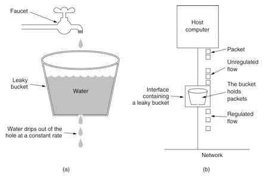
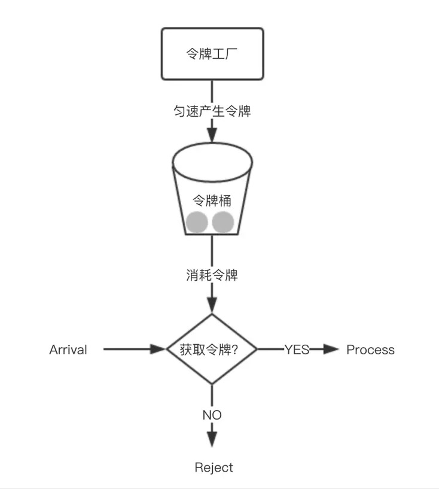

# 限流算法

## 随机丢弃（线上服务）

例如通过Apollo灰度放量80%，那么就会随机丢弃掉20%的流量。

## 计数器算法

限制qps为100，那么从第一个请求进来开始计数，在1秒内请求累计超过100次就拒绝后续所有请求，一秒后重置计数器为0。

> 缺陷：假设在1s内前10ms已经有100个请求，那么剩下990ms的请求会被全部拒绝。即“突刺现象”。

## 漏桶算法

相当于请求进来后会进入到任务队列先hold住，然后工作线程不停消费。

> 缺陷：处理请求的速度是约定好的（比如每10ms处理一次请求），但是请求进来的量是未知的，**如果超过桶容量的话就会导致新进来的请求被丢弃。即无法应对短时间的突发流量（线程池是按照固定速度消费队列的）**。

## 令牌桶算法

**原理**：在令牌桶算法中存在一个桶，用来存放固定数量的令牌并且我们以一定的速率往桶中放令牌。每次请求服务需要先获取令牌，只有拿到令牌才能继续执行，否则选择等待可用的令牌或者直接拒绝。

**令牌生产**：放令牌这个动作是持续不停匀速生产的，如果桶中令牌达到上限就丢弃令牌（桶仍然有容量上限）。只有桶中没有令牌时，请求才会进入等待。

**算法实现**：准备一个队列保存令牌，另外通过一个线程池定期生成令牌放到队列中。每来一个请求就尝试获取一个令牌，获取成功就执行。

## 集群限流

前面讨论的“计数器算法”、“漏桶算法”和“令牌桶”算法都是单机限流算法，保障一台机器服务稳定性。

> 试想一下，如果问题是限制某个资源被每个用户或者服务的调用次数，5s只能访问2次，或者一天只能调用10000次。上面提到的算法是无法实现的，只能通过集群限流实现。

**实现**：**为了控制每个用户的访问次数，可以将访问次数保存在第三方服务比如Redis中。通过给key加上过期时间，可以限制指定时间内的访问频率**。
