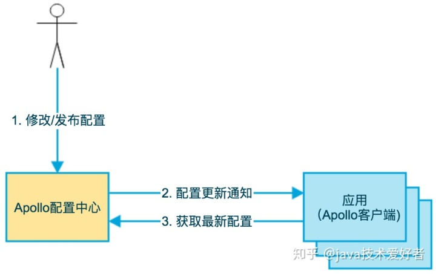
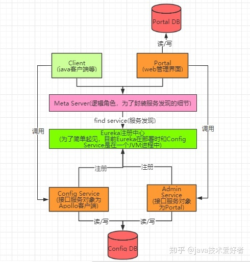
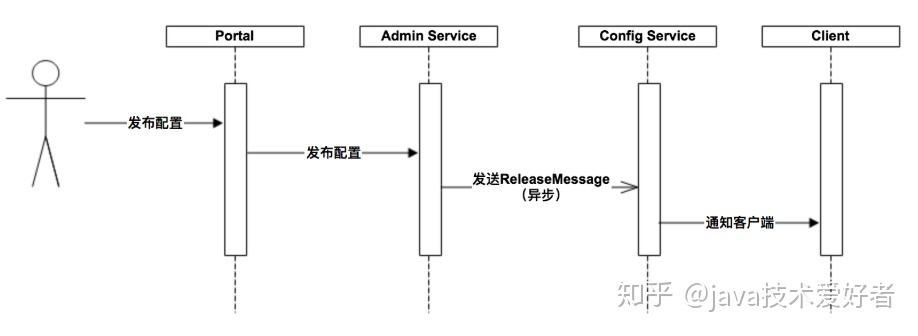
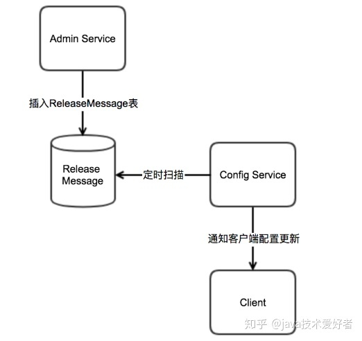
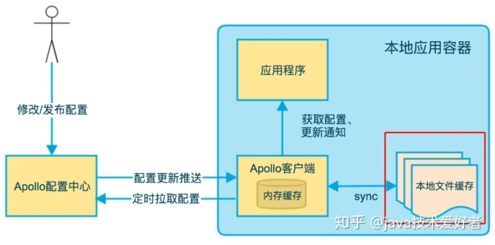
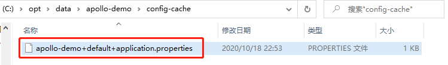

# 配置热更新服务

## 概述

Apollo（阿波罗）是携程框架部门研发的开源配置管理中心，能够集中化管理应用**不同环境、不同集群**的配置，配置修改后能够**实时推送到应用端，并且具备规范的权限、流程治理**等特性。

目前Apollo在github有22.6k颗星，在官网登记的使用的公司有451家，算是很流行的配置中心的框架技术。所以接下来跟着我一起学习Apollo配置中心吧。

## 为什么使用配置中心

首先，没有配置中心之前传统的配置都是写在配置文件中，比如各种[yml](https://www.zhihu.com/search?q=yml&search_source=Entity&hybrid_search_source=Entity&hybrid_search_extra={"sourceType"%3A"article"%2C"sourceId"%3A"267162370"})、perproties、xml文件。

写在各种文件里最大的问题在于**如果需要改配置信息，需要重新部署发布应用才能生效**，这是第一个问题。

后面为了做到动态读取配置信息，后面有人改进一下把配置信息存储在数据库的一张表，程序读取表中的配置信息，这种方式很多公司都还在使用，因为简单，而且灵活(修改配置只需要执行个SQL语句，不需要重新部署发布)。但是也不是最完美的，因为**缺少了权限控制，没有管理界面进行统一配置，没有历史版本的配置信息，不支持回滚(防止误操作)**。

首先，没有配置中心之前传统的配置都是写在配置文件中，比如各种[yml](https://www.zhihu.com/search?q=yml&search_source=Entity&hybrid_search_source=Entity&hybrid_search_extra={"sourceType"%3A"article"%2C"sourceId"%3A"267162370"})、perproties、xml文件。

写在各种文件里最大的问题在于**如果需要改配置信息，需要重新部署发布应用才能生效**，这是第一个问题。

后面为了做到动态读取配置信息，后面有人改进一下把配置信息存储在数据库的一张表，程序读取表中的配置信息，这种方式很多公司都还在使用，因为简单，而且灵活(修改配置只需要执行个SQL语句，不需要重新部署发布)。但是也不是最完美的，因为**缺少了权限控制，没有管理界面进行统一配置，没有历史版本的配置信息，不支持回滚(防止误操作)**。

## 架构设计

### 1. 基础模型

作者在官网上有个基础模型的架构图，忽略掉很多细节后实际上非常简单：

1. 用户在配置中心对配置进行修改并发布。
2. 配置中心通知Apollo客户端有配置更新。
3. Apollo客户端从配置中心拉取最新的配置、更新本地配置并通知到应用。

### 2. 架构模块

如果我们把Apollo配置中心服务端展开的话，架构图如下：

看到这里，整个架构看起来就比较清晰了。接下来从上往下简单介绍一下：

**Portal服务**：提供Web界面供用户管理配置，通过MetaServer获取AdminService服务列表（IP+Port），通过IP+Port访问AdminService服务。

**Client**：实际上就是我们创建的SpringBoot项目，引入ApolloClient的maven依赖，为应用提供配置获取、实时更新等功能。

**Meta Server**：从Eureka获取Config Service和Admin Service的服务信息，相当于是一个Eureka Client。主要是为了封装服务发现的细节，对Portal和Client而言，永远通过一个Http接口获取Admin Service和Config Service的服务信息，而不需要关心背后实际的服务注册和发现组件。Meta Server只是一个逻辑角色，在部署时和Config Service是在一个JVM进程中的，所以IP、端口和Config Service一致。

**Eureka**：注册中心。Config Service和Admin Service会向Eureka注册服务。为了简单起见，目前Eureka在部署时和Config Service是在一个JVM进程中的。

**Config Service**：提供配置获取接口。提供配置更新推送接口(基于Http long polling)。服务对象为Apollo客户端(Client)。

**Admin Service**：提供配置管理接口。提供配置发布、修改等接口。服务对象为Portal。

### 3. 配置发布后的实时推送设计

上面讲完各个角色的用途，那这些角色是怎么配合一起工作的呢，我们来看一张图：

上图简要描述了配置发布的大致过程：

1. 用户在Portal操作配置发布。
2. Portal调用Admin Service的接口操作发布。
3. Admin Service发布配置后，发送ReleaseMessage给各个Config Service。
4. Config Service收到ReleaseMessage后，通知对应的客户端(Client)。

关键点在于AdminService发送ReleaseMessage给ConfigService，这一步是如何异步发送的呢，==一般异步发送我们很容易想到消息队列，但是实际上我们在安装部署时并没有使用到消息队列==。

答案在于：

* Admin Service在配置发布后会往ReleaseMessage表插入一条消息记录，消息内容就是配置发布的AppId+Cluster+Namespace。

* 然后Config Service有一个线程会每秒扫描一次ReleaseMessage表，看看是否有新的消息记录。

* Config Service如果发现有新的消息记录，那么就会通知到所有的消息监听器，监听器得到配置发布的AppId+Cluster+Namespace后，会通知对应的客户端。

> 在实现上，考虑到Apollo的实际使用场景，以及为了尽可能减少外部依赖，我们没有采用外部的消息中间件，而是通过数据库实现了一个简单的消息队列。----来自官网

### 4. 高可用

Apollo为了实现高可用，服务端使用了Eureka作为注册中心，这一点在官网也有谈到。

除此之外，客户端也做了高可用的一些架构设计，比如本地[文件缓存](https://www.zhihu.com/search?q=文件缓存&search_source=Entity&hybrid_search_source=Entity&hybrid_search_extra={"sourceType"%3A"article"%2C"sourceId"%3A"267162370"})。

这个缓存文件默认就放在C:\opt\data\apollo-demo\config-cache路径下：

这个文件的作用是，在遇到服务不可用，或网络不通的时候，依然能从本地恢复配置。
