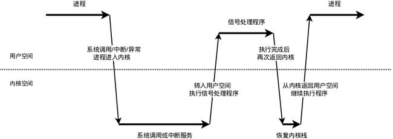

# coredump

## coredump原理

当程序发生内存越界访问等行为时，会触发OS的保护机制，此时OS会产生一个信号(signal)发送给对应的进程。**当进程从内核态到用户态切换时，该进程会处理这个信号。**此类信号（比如SEGV）的默认处理行为生成一个coredump文件。

## 信号处理机制

* 信号是Linux进程间的异步通信机制，当信号发送到某个进程时，操作系统会通过**软中断**打断该进程的正常流程，并进入到事先注册好的“信号处理函数”中执行操作，完成后再返回到中断的地方继续执行。

* **既然信号是异步的，这就涉及信号何时接收、何时处理的问题。**

* 用户函数运行在用户态，当遇到**系统调用、中断或是异常时**，程序就需要进入内核态。
  * **信号接收**：接收信号的任务是内核代理的，**当内核收到信号后会将其放到进程对应的信号队列**中，**同时向进程发送一个软中断，使其陷入到内核态**。（进程收到信号但暂未处理的状态被称为信号未决Pending，此时进程是不知道有信号带来的）
  * **信号检测**：程序进入内核态后，从睡眠状态被唤醒时进行内核检测，或者从内核态返回到用户态进行信号检测，发现有信号时就进入下一步：信号处理。
  * **信号处理**：
    * 信号处理函数需要运行在用户态（防止权力过高造成危险），因此在调用信号处理函数前需要将内核栈内容拷贝到用户栈上，修改指令寄存器eip指向信号处理函数。
    * 返回到用户态进行信号处理。
    * 信号处理完成后返回到内核态，检查是否还有其他信号没处理，所有信号都处理完成后就恢复内核栈（从用户栈的备份拷贝回来），恢复指令寄存器（eip）指向中断前的位置，最后返回到用户态继续执行。
  
  

* **信号来源**：
  * **用户**：用户可以通过输入`Ctrl+C`和`Ctrl+\`等命令
  * **内核**：进程执行出错，内核给进程发送一个信号。 例如，非法段存取，浮点数溢出，亦或是一个非法指令，内核也利用信号通知进程特定事件发生。
  * **进程**：一个进程可以通过系统调用kill给另外一个进程发送信号， 一个进程可以和另一个进程通过信号通信。

## 多线程下的信号处理

信号可以发给整个进程，也可以发给特定线程：

* 发给整个进程的信号，随机选取一个线程进行执行
* 发给特定线程的信号，只能由特定的线程负责处理。一些信号如果是某些线程代码的直接执行而引发，那么只能由特定的线程负责执行，例如`SIGBUS, SIGFPE, SIGILL, SIGSEG`。

## 常见问题

### 1. traceback()不可重入

`traceback()`里面使用了malloc，是不可重入的，很有可能导致服务死锁。

### 2. 信号处理函数没执行exit

crash会继续进行下去，因为会继续返回到产生crash信号的那一行。

### 3. 为什么存在crash堆栈没打印完全的情况

某个线程执行完`traceback()`后调用`exit()`函数退出，而`exit()`函数不是一个C++函数，不满足RAII原则，它不会清理对应的C++对象，包括ostream和特定对象的析构函数等。

## 常见信号

认行为含有coredump的信号种类如下，一般最常见的就是8和11：

| 信号    | 值   | 发出信号的原因             |
| ------- | ---- | -------------------------- |
| SIGQUIT | 3    | Quit from keyboard         |
| SIGILL  | 4    | Illegal instruction        |
| SIGABRT | 6    | Abort signal from abort(3) |
| SIGFPE  | 8    | Floating point exception   |
| SIGSEGV | 11   | Invalid memory reference   |
