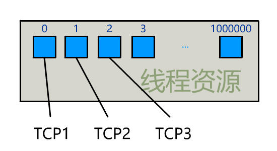
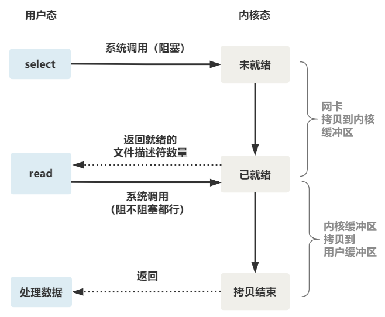

# IO 多路复用

## 阻塞 IO

服务端为了处理客户端的连接和请求的数据，写了如下代码：

```C
listenfd = socket();   // 打开一个网络通信端口
bind(listenfd);        // 绑定
listen(listenfd);      // 监听
while(1) {
  connfd = accept(listenfd);  // 阻塞建立连接
  int n = read(connfd, buf);  // 阻塞读数据
  doSomeThing(buf);  // 利用读到的数据做些什么
  close(connfd);     // 关闭连接，循环等待下一个连接
}
```

这段代码的执行过程如下：


可以看到服务器的线程阻塞在了两个地方：

* accept 函数
* read 函数

我们再把 read 函数的细节展开，可以发现其阻塞在了两个地方：


这就是传统的阻塞 IO，整理流程如下图所示：


所以，如果这个连接的客户端一直不发数据，那么服务端线程将会一直阻塞在 read 函数上不返回，也无法接受其他客户端连接。

这肯定是不行的。

## 非阻塞 IO

为了解决上面的问题，其关键在于改造这个 read 函数。

有一种聪明的办法是，每次都创建一个新的进程或线程，去调用 read 函数，并做业务处理。

```c
while(1) {
  connfd = accept(listenfd);  // 阻塞建立连接
  pthread_create（doWork);    // 创建一个新的线程
}
void doWork() {
  int n = read(connfd, buf);  // 阻塞读数据
  doSomeThing(buf);  // 利用读到的数据做些什么
  close(connfd);     // 关闭连接，循环等待下一个连接
}
```

这样，当给一个客户端建立好连接后，就可以立刻等待新的客户端连接，而不用阻塞在原客户端的 read 请求上。


不过，这不叫非阻塞 IO，只不过用了多线程的手段使得主线程没有卡在 read 函数上不往下走罢了。操作系统为我们提供的 read 函数仍然是阻塞的。

所以真正的非阻塞 IO，不能是通过我们用户层的小把戏，**而是要恳请操作系统为我们提供一个非阻塞的 read 函数**。这个 read 函数的效果是，如果没有数据到达时（到达网卡并拷贝到了内核缓冲区），立刻返回一个错误值（-1），而不是阻塞地等待。

操作系统提供了这样的功能，只需要在调用 read 前，将文件描述符设置为非阻塞即可。

```C
fcntl(connfd, F_SETFL, O_NONBLOCK);
int n = read(connfd, buffer) != SUCCESS);
```

这样，就需要用户线程循环调用 read，直到返回值不为-1，再开始处理业务。


这里非阻塞的 read，指的是在数据到达前，即数据还未到达网卡，或者到达网卡但还没有拷贝到内核缓冲区之前，这个阶段是非阻塞的。

当数据已到达内核缓冲区，此时调用 read 函数仍然是阻塞的，需要等待数据从内核缓冲区拷贝到用户缓冲区，才能返回。

整体流程如下图：


## IO 多路复用

为每个客户端创建一个线程，服务器端的线程资源很容易被耗光。



当然还有个聪明的办法，我们可以每 accept 一个客户端连接后，将这个文件描述符（connfd）放到一个数组里。

```c
fdlist.add(connfd);
```

然后弄一个新的线程去不断遍历这个数组，调用每一个元素的非阻塞 read 方法。

```
while(1) {
  for(fd <-- fdlist) {
    if(read(fd) != -1) {
      doSomeThing();
    }
  }
}
```

这样，我们就成功用一个线程处理了多个客户端连接。


但这和我们用多线程去将阻塞 IO 改造成看起来是非阻塞 IO 一样，这种遍历方式也只是我们用户自己想出的小把戏，**每次遍历遇到 read 返回-1 时仍然是一次浪费资源的系统调用**。

所以最好还是操作系统提供一个有相同效果的函数，我们将一批文件描述符通过一次系统调用传给内核，由内核层去遍历，才能真正解决这个问题。

### 1. select

select 是操作系统提供的系统调用函数，==通过它我们可以把一个文件描述符的数组发给操作系统， 让操作系统去遍历，确定哪个文件描述符可以读写， 然后告诉我们去处理：==


select 系统调用的函数定义如下：

```c
int select(
    int nfds,
    fd_set *readfds,
    fd_set *writefds,
    fd_set *exceptfds,
    struct timeval *timeout);
// nfds:监控的文件描述符集里最大文件描述符加 1
// readfds：监控有读数据到达文件描述符集合，传入传出参数
// writefds：监控写数据到达文件描述符集合，传入传出参数
// exceptfds：监控异常发生达文件描述符集合, 传入传出参数
// timeout：定时阻塞监控时间，3 种情况
//  1.NULL，永远等下去
//  2.设置 timeval，等待固定时间
//  3.设置 timeval 里时间均为 0，检查描述字后立即返回，轮询
```

服务端代码创建一个线程不断接受客户端连接，并把 socket 文件描述符放到一个 list 里：

```c
while(1) {
  connfd = accept(listenfd);
  fcntl(connfd, F_SETFL, O_NONBLOCK);
  fdlist.add(connfd);
}
```

服务端再创建另一个线程调用 select，把这批文件描述符 list 交给操作系统去遍历：

```c
while(1) {
  // 把一堆文件描述符 list 传给 select 函数
  // 有已就绪的文件描述符就返回，nready 表示有多少个就绪的
  nready = select(list);
  ...
}
```

不过，当 select 函数返回后，用户依然需要遍历刚刚提交给操作系统的 list。只不过，操作系统会将准备就绪的文件描述符做上标识，用户层将不会再有无意义的系统调用开销。

```c
while(1) {
  nready = select(list);
  // 用户层依然要遍历，只不过少了很多无效的系统调用
  for(fd <-- fdlist) {
    if(fd != -1) {
      // 只读已就绪的文件描述符
      read(fd, buf);
      // 总共只有 nready 个已就绪描述符，不用过多遍历
      if(--nready == 0) break;
    }
  }
}
```

正如刚刚的动图中所描述的，其直观效果如下：


其中包含几个可优化的细节：

* ==select 调用需要传入 fd 数组，需要拷贝一份到内核，高并发场景下这样的拷贝消耗的资源是惊人的==。（可优化为不复制）
* ==select 在内核层仍然是通过遍历的方式检查文件描述符的就绪状态，是个同步过程，只不过无系统调用切换上下文的开销==。（内核层可优化为异步事件通知）
* ==select 仅仅返回可读文件描述符的个数，具体哪个可读还是要用户自己遍历。==（可优化为只返回给用户就绪的文件描述符，无需用户做无效的遍历）

整个 select 的流程图如下：



可以看到，这种方式，既做到了一个线程处理多个客户端连接（文件描述符），又减少了系统调用的开销。多个文件描述符只有一次 select 的系统调用和 n 次就绪状态的文件描述符的 read 系统调用。

### 2. poll

**==poll 也是操作系统提供的系统调用函数。它和 select 的主要区别就是，底层用链表而非数组管理 fd，去掉了 select 只能监听 1024 个文件描述符的限制。==**

```c
int poll(struct pollfd *fds, nfds_tnfds, int timeout);

struct pollfd {
  intfd;        /*文件描述符*/
  shortevents;  /*监控的事件*/
  shortrevents; /*监控事件中满足条件返回的事件*/
};
```

### 3. epoll

epoll 是最终的大 boss，它解决了 select 和 poll 的一些问题。

它针对我们前面提到的 select 三个可优化的细节做了改进：

* 内核中保存一份文件描述符集合，无需用户每次都重新传入，只需告诉内核修改的部分即可。
* 内核不再通过轮询的方式找到就绪的文件描述符，而是通过异步 IO 事件唤醒。
* 内核仅会将有 IO 事件的文件描述符返回给用户，用户也无需遍历整个文件描述符集合。

操作系统具体提供了三个函数：

第一步，创建一个 epoll 句柄：

```c
int epoll_create(int size);
```

第二步，向内核添加、修改或删除要监控的文件描述符：

```c
int epoll_ctl(int epfd, int op, int fd, struct epoll_event *event);
```

第三步，发起类似的 select 调用：

```c
int epoll_wait(int epfd, struct epoll_event *events, int max events, int timeout);
```

内部原理如下图所示：


> 如果要深入了解 epool 原理，可以阅读：《[图解 | 深入揭秘 epoll 是如何实现 IO 多路复用的！](http://mp.weixin.qq.com/s?__biz=MjM5Njg5NDgwNA==&mid=2247484905&idx=1&sn=a74ed5d7551c4fb80a8abe057405ea5e&chksm=a6e304d291948dc4fd7fe32498daaae715adb5f84ec761c31faf7a6310f4b595f95186647f12&scene=21#wechat_redirect)》

## 总结

一切的开始，都起源于这个 read 函数是操作系统提供的，而且是阻塞的，我们叫它 **阻塞 IO**。

为了破这个局，程序员在用户态通过多线程来防止主线程卡死。后来操作系统发现这个需求比较大，于是在操作系统层面提供了非阻塞的 read 函数，这样程序员就可以在一个线程内完成多个文件描述符的读取，这就是**非阻塞 IO**。

但多个文件描述符的读取就需要遍历，当高并发场景越来越多时，用户态遍历的文件描述符也越来越多，相当于在 while 循环里进行了越来越多的系统调用。后来操作系统又发现这个场景需求量较大，于是又在操作系统层面提供了这样的遍历文件描述符的机制，这就是 **IO 多路复用**。多路复用有三个函数，最开始是 select，然后又发明了 poll 解决了 select 文件描述符的限制，然后又发明了 epoll 解决 select 的三个不足。

所以，IO 模型的演进，其实就是时代的变化，倒逼着操作系统将更多的功能加到自己的内核而已。网上好多文章说，多路复用之所以效率高，是因为用一个线程就可以监控多个文件描述符。这显然是知其然而不知其所以然，多路复用产生的效果，完全可以由用户态去遍历文件描述符并调用其非阻塞的 read 函数实现。而多路复用快的原因在于，操作系统提供了这样的系统调用，使得原来的 while 循环里多次系统调用，变成了一次系统调用 + 内核层遍历这些文件描述符。

## Reference

[1] <https://blog.csdn.net/bjweimengshu/article/details/115744124>
