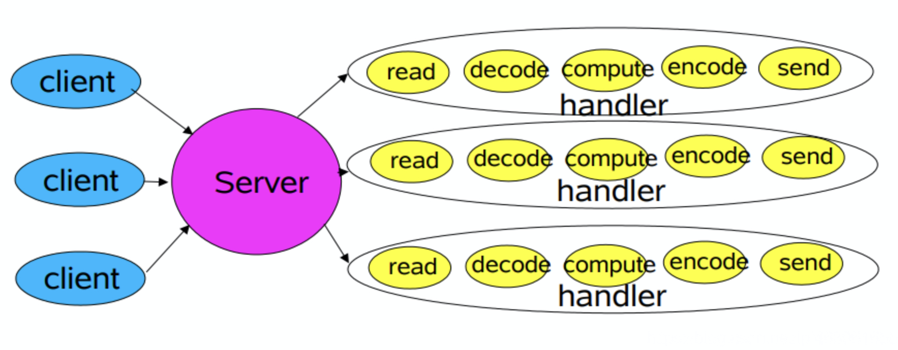
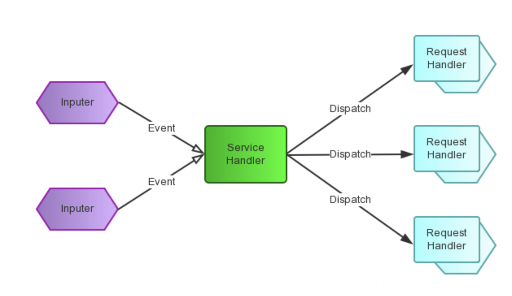
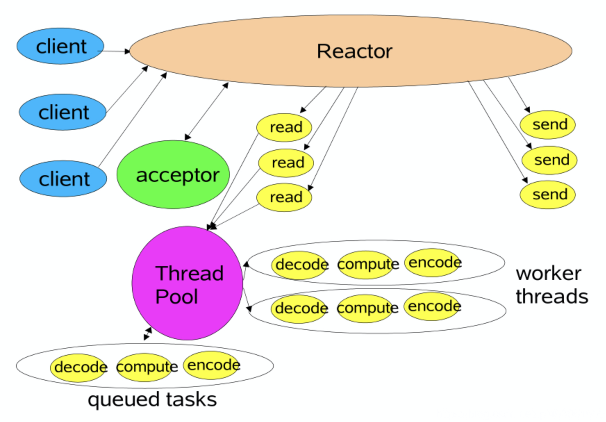
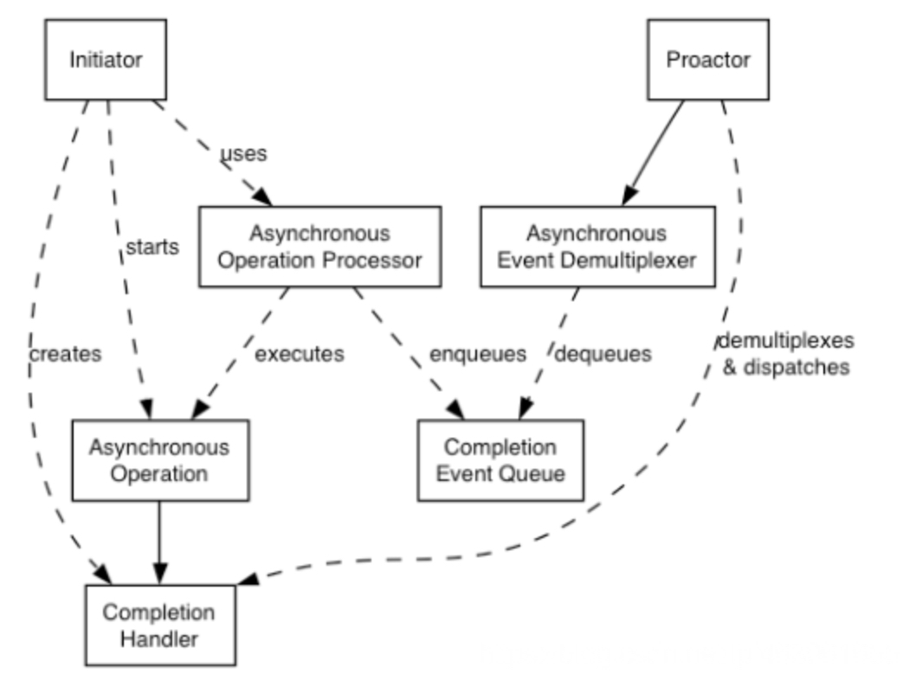
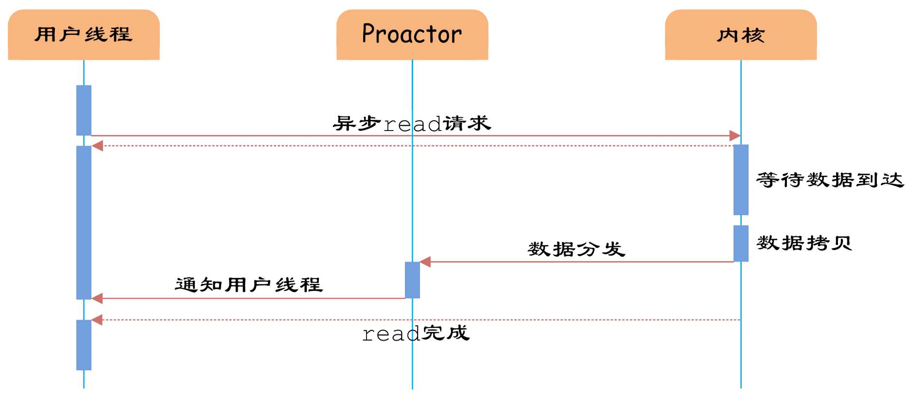

# 基于事件驱动的 reactor 模式

## 基于线程的架构

thread-based architecture（基于线程的架构），通俗的说就是：多线程并发模式，一个连接一个线程，服务器每当收到客户端的一个请求， 便开启一个独立的线程来处理。

一定程度上极大地提高了服务器的吞吐量，由于在不同线程中，之前的请求在 read 阻塞以后，不会影响到后续的请求。但是，仅适用于于并发量不大的场景，因为：

* 线程需要占用一定的内存资源
* 创建和销毁线程也需一定的代价
* 操作系统在切换线程也需要一定的开销
* 线程处理 I/O，在等待输入或输出的这段时间处于空闲的状态，同样也会造成 cpu 资源的浪费

**如果连接数太高，系统将无法承受**。

## 事件驱动模型

事件驱动体系结构是目前比较广泛使用的一种。这种方式会定义一系列的事件处理器来响应事件的发生，并且将服务端接受连接与对事件的处理分离。其中，事件是一种状态的改变。比如，tcp 中 socket 的 new incoming connection、ready for read、ready for write。

Reactor 模式和 Proactor 模式都是是 event-driven architecture（事件驱动模型）的实现方式，下面聊一聊这两种模式。

### 1. Reactor 模式

维基百科对`Reactor pattern`的解释：

> The reactor design pattern is an event handling pattern for handling service requests delivered concurrently to a service handler by one or more inputs. The service handler then demultiplexes the incoming requests and dispatches them synchronously to the associated request handlers

从这个描述中，我们知道 Reactor 模式首先是事件驱动的，有一个或多个并发输入源，有一个 Service Handler，有多个 Request Handlers；Service Handler 会对输入的请求（Event）进行多路复用，并同步地将它们分发给相应的 Request Handler。
下面的图将直观地展示上述文字描述：

Reactor 模式也有三种不同的方式，下面一一介绍。

#### 3.1 Reactor 模式-单线程模式

Java 中的 NIO 模式的 Selector 网络通讯，其实就是一个简单的 Reactor 模型。可以说是单线程的 Reactor 模式。

Reactor 的单线程模式的单线程主要是针对于 I/O 操作而言，也就是所有的 I/O 的 accept()、read()、write()以及 connect()操作都在一个线程上完成的。

但在目前的单线程 Reactor 模式中，不仅 I/O 操作在该 Reactor 线程上，连非 I/O 的业务操作也在该线程上进行处理了，这可能会大大延迟 I/O 请求的响应。所以我们应该将非 I/O 的业务逻辑操作从 Reactor 线程上卸载，以此来加速 Reactor 线程对 I/O 请求的响应。

#### 3.2 Reactor 模式-工作者线程池模式

与单线程模式不同的是，添加了一个**工作者线程池**，并将非 I/O 操作从 Reactor 线程中移出转交给工作者线程池（Thread Pool）来执行。这样能够提高 Reactor 线程的 I/O 响应，不至于因为一些耗时的业务逻辑而延迟对后面 I/O 请求的处理。

在工作者线程池模式中，虽然非 I/O 操作交给了线程池来处理，但是**所有的 I/O 操作依然由 Reactor 单线程执行**，在高负载、高并发或大数据量的应用场景，依然较容易成为瓶颈。所以，对于 Reactor 的优化，又产生出下面的多线程模式。

#### 3.3 Reactor 模式-多线程模式

对于多个 CPU 的机器，为充分利用系统资源，将 Reactor 拆分为两部分：mainReactor 和 subReactor。

**mainReactor**负责监听 server socket，用来处理网络新连接的建立，将建立的 socketChannel 指定注册给 subReactor，通常**一个线程**就可以处理 ；

**subReactor**维护自己的 selector, 基于 mainReactor 注册的 socketChannel 多路分离 I/O 读写事件，读写网络数据，通常使用**多线程**；

对非 I/O 的操作，依然转交给工作者线程池（Thread Pool）执行。

此种模型中，每个模块的工作更加专一，耦合度更低，性能和稳定性也大量的提升，支持的可并发客户端数量可达到上百万级别。关于此种模型的应用，目前有很多优秀的框架已经在应用了，比如 mina 和 netty 等。Reactor 模式-多线程模式下去掉工作者线程池（Thread Pool），则是 Netty 中 NIO 的默认模式。

* mainReactor 对应 Netty 中配置的 BossGroup 线程组，主要负责接受客户端连接的建立。一般只暴露一个服务端口，BossGroup 线程组一般一个线程工作即可
* subReactor 对应 Netty 中配置的 WorkerGroup 线程组，BossGroup 线程组接受并建立完客户端的连接后，将网络 socket 转交给 WorkerGroup 线程组，然后在 WorkerGroup 线程组内选择一个线程，进行 I/O 的处理。WorkerGroup 线程组主要处理 I/O，一般设置 2*CPU 核数个线程

### 2. Proactor 模式

流程与 Reactor 模式类似，区别在于 proactor 在 IO ready 事件触发后，完成 IO 操作再通知应用回调。虽然在 linux 平台还是基于 epoll/select，但是内部实现了异步操作处理器(Asynchronous Operation Processor)以及异步事件分离器(Asynchronous Event Demultiplexer)将 IO 操作与应用回调隔离。经典应用例如 boost asio 异步 IO 库的结构和流程图如下：

在 Proactor 模式中，当检测到有事件发生时，会新起一个异步操作，然后交由内核线程去处理，当内核线程完成 IO 操作之后，发送一个通知告知操作已完成，可以得知，异步 IO 模型采用的就是 Proactor 模式。

“真正”的异步 IO 需要操作系统更强的支持。在 IO 多路复用模型中，事件循环将文件句柄的状态事件通知给用户线程，由用户线程自行读取数据、处理数据。而在异步 IO 模型中，当用户线程收到通知时，数据已经被内核读取完毕，并放在了用户线程指定的缓冲区内，内核在 IO 完成后通知用户线程直接使用即可。

异步 IO 模型使用了 Proactor 设计模式实现了这一机制。

Reactor 模式中，用户线程通过向 Reactor 对象注册感兴趣的事件监听，然后事件触发时调用事件处理函数。而 Proactor 模式中，用户线程将 AsynchronousOperation（读/写等）、Proactor 以及操作完成时的 CompletionHandler 注册到 AsynchronousOperationProcessor。

AsynchronousOperationProcessor 使用 Facade 模式提供了一组异步操作 API（读/写等）供用户使用，当用户线程调用异步 API 后，便继续执行自己的任务。AsynchronousOperationProcessor 会开启独立的内核线程执行异步操作，实现真正的异步。当异步 IO 操作完成时，AsynchronousOperationProcessor 将用户线程与 AsynchronousOperation 一起注册的 Proactor 和 CompletionHandler 取出，然后将 CompletionHandler 与 IO 操作的结果数据一起转发给 Proactor，Proactor 负责回调每一个异步操作的事件完成处理函数 handle_event。虽然 Proactor 模式中每个异步操作都可以绑定一个 Proactor 对象，但是一般在操作系统中，Proactor 被实现为 Singleton 模式，以便于集中化分发操作完成事件。

异步 IO 模型中，用户线程直接使用内核提供的异步 IO API 发起 read 请求，且发起后立即返回，继续执行用户线程代码。不过此时用户线程已经将调用的 AsynchronousOperation 和 CompletionHandler 注册到内核，然后操作系统开启独立的内核线程去处理 IO 操作。当 read 请求的数据到达时，由内核负责读取 socket 中的数据，并写入用户指定的缓冲区中。最后内核将 read 的数据和用户线程注册的 CompletionHandler 分发给内部 Proactor，Proactor 将 IO 完成的信息通知给用户线程（一般通过调用用户线程注册的完成事件处理函数），完成异步 IO。

相比于 IO 多路复用模型，异步 IO 并不十分常用，不少高性能并发服务程序使用 IO 多路复用模型+多线程任务处理的架构基本可以满足需求。况且目前操作系统对异步 IO 的支持并非特别完善，更多的是采用 IO 多路复用模型模拟异步 IO 的方式（IO 事件触发时不直接通知用户线程，而是将数据读写完毕后放到用户指定的缓冲区中）。Java7 之后已经支持了异步 IO

### 3. 两种模式的对比

#### 3.1 主动和被动

以主动写为例：

Reactor 将 handler 放到 select()，等待可写就绪，然后调用 write()写入数据；写完处理后续逻辑；
Proactor 调用 aoi_write 后立刻返回，由内核负责写操作，写完后调用相应的回调函数处理后续逻辑
Reactor 模式是一种被动的处理，即有事件发生时被动处理。而 Proator 模式则是主动发起异步调用，然后循环检测完成事件。

#### 3.2 实现

Reactor 实现了一个被动的事件分离和分发模型，服务等待请求事件的到来，再通过不受间断的同步处理事件，从而做出反应；

Proactor 实现了一个主动的事件分离和分发模型；这种设计允许多个任务并发的执行，从而提高吞吐量。

所以涉及到文件 I/O 或耗时 I/O 可以使用 Proactor 模式，或使用多线程模拟实现异步 I/O 的方式。

#### 3.3 优点

Reactor 实现相对简单，对于链接多，但耗时短的处理场景高效；

操作系统可以在多个事件源上等待，并且避免了线程切换的性能开销和编程复杂性；
事件的串行化对应用是透明的，可以顺序的同步执行而不需要加锁；
事务分离：将与应用无关的多路复用、分配机制和与应用相关的回调函数分离开来。
Proactor 在理论上性能更高，能够处理耗时长的并发场景。为什么说在理论上？请自行搜索 Netty 5.X 版本废弃的原因。

#### 3.4 缺点

Reactor 处理耗时长的操作会造成事件分发的阻塞，影响到后续事件的处理；

Proactor 实现逻辑复杂；依赖操作系统对异步的支持，目前实现了纯异步操作的操作系统少，实现优秀的如 windows IOCP，但由于其 windows 系统用于服务器的局限性，目前应用范围较小；而 Unix/Linux 系统对纯异步的支持有限，应用事件驱动的主流还是通过 select/epoll 来实现。

#### 3.5 适用场景

Reactor：同时接收多个服务请求，并且依次同步的处理它们的事件驱动程序；

Proactor：异步接收和同时处理多个服务请求的事件驱动程序。

> ux 系统对纯异步的支持有限，应用事件驱动的主流还是通过 select/epoll 来实现。

## Reference

[1] <https://blog.csdn.net/lpf463061655/article/details/103403881>
