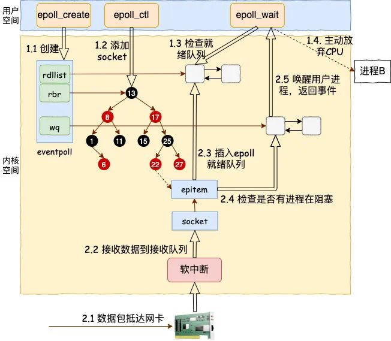

# epoll

## 前言

进程在 Linux 上是一个开销不小的家伙，先不说创建，光是上下文切换一次就得几个微秒。所以为了高效地对海量用户提供服务，必须要让一个进程能同时处理很多个 tcp 连接才行。现在假设一个进程保持了 10000 条连接，那么如何发现哪条连接上有数据可读了、哪条连接可写了 ？

我们当然可以采用循环遍历的方式来发现 IO 事件，但这种方式太低级了。我们希望有一种更高效的机制，在很多连接中的某条上有 IO 事件发生的时候直接快速把它找出来。其实这个事情 Linux 操作系统已经替我们都做好了，它就是我们所熟知的 **IO 多路复用**机制。这里的复用指的就是对进程的复用。

在 Linux 上多路复用方案有 select、poll、epoll。它们三个中 epoll 的性能表现是最优秀的，能支持的并发量也最大。所以我们今天把 epoll 作为要拆解的对象，深入揭秘内核是如何实现多路的 IO 管理的。

为了方便讨论，我们举一个使用了 epoll 的简单示例（只是个例子，实践中不这么写）：

```C
int main(){
    listen(lfd, ...);
 
    cfd1 = accept(...);
    cfd2 = accept(...);
    efd = epoll_create(...);
 
    epoll_ctl(efd, EPOLL_CTL_ADD, cfd1, ...);
    epoll_ctl(efd, EPOLL_CTL_ADD, cfd2, ...);
    epoll_wait(efd, ...)
}
```

其中和 epoll 相关的函数是如下三个：

- epoll_create：创建一个 epoll 对象
- epoll_ctl：向 epoll 对象中添加要管理的连接
- epoll_wait：等待其管理的连接上的 IO 事件

## 总结

我们来用一幅图总结一下 epoll 的整个工作路程。



其中软中断回调的时候回调函数也整理一下：

- sock_def_readable：sock 对象初始化时设置的
- => ep_poll_callback : epoll_ctl 时添加到 socket 上的
- => default_wake_function: epoll_wait 是设置到 epoll 上的

总结下，epoll 相关的函数里内核运行环境分两部分：

- 用户进程内核态。进行调用 epoll_wait 等函数时会将进程陷入内核态来执行。这部分代码负责查看接收队列，以及负责把当前进程阻塞掉，让出 CPU。
- 硬软中断上下文。在这些组件中，将包从网卡接收过来进行处理，然后放到 socket 的接收队列。对于 epoll 来说，再找到 socket 关联的 epitem，并把它添加到 epoll 对象的就绪链表中。这个时候再捎带检查一下 epoll 上是否有被阻塞的进程，如果有唤醒之。

为了介绍到每个细节，本文涉及到的流程比较多，把阻塞都介绍进来了。

> 但其实**在实践中，只要活儿足够的多，epoll_wait 根本都不会让进程阻塞**。用户进程会一直干活，一直干活，直到 epoll_wait 里实在没活儿可干的时候才主动让出 CPU。这就是 epoll 高效的地方所在！
