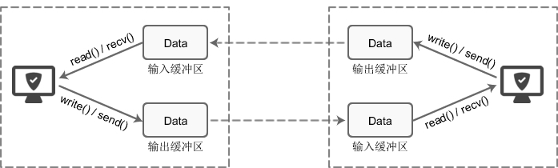

# socket 缓冲区

## 简介

write()/send() 并不立即向网络中传输数据，而是先将数据写入缓冲区中，再由 TCP 协议将数据从缓冲区发送到目标机器。**一旦将数据写入到缓冲区，函数就可以成功返回，不管它们有没有到达目标机器，也不管它们何时被发送到网络，这些都是 TCP 协议负责的事情。**

> **TCP 协议独立于 write()/send() 函数，数据有可能刚被写入缓冲区就发送到网络，也可能在缓冲区中不断积压，多次写入的数据被一次性发送到网络，这取决于当时的网络情况、当前线程是否空闲等诸多因素，不由程序员控制。**

**read()/recv() 函数也是如此，也从输入缓冲区中读取数据，而不是直接从网络中读取。**

## 缓冲区特性

这些 I/O 缓冲区特性可整理如下：

* **I/O 缓冲区在每个 TCP 套接字中单独存在**；
* **I/O 缓冲区在创建套接字时自动生成**；
* **即使关闭套接字也会继续传送输出缓冲区中遗留的数据**；
* **关闭套接字将丢失输入缓冲区中的数据**。

## 缓冲区大小

**输入输出缓冲区的默认大小一般都是 8K**，可以通过 `getsockopt()` 函数获取。

## 阻塞模式

#### 1. 使用 write()/send() 发送数据

> 总结：
>
> * **输出缓冲区不足 或者 TCP 正在发送数据时，不允许写入**
> * **如要要写入的数据大于缓冲区的最大长度，那么会分批写入直到所有的数据都被写入缓冲区**

* **首先会检查缓冲区，**如果缓冲区的可用空间长度小于要发送的数据，那么 write()/send() 会被阻塞（暂停执行）**，直到缓冲区中的数据被发送到目标机器，腾出足够的空间，才唤醒 write()/send() 函数继续写入数据；**
* **如果 TCP 协议正在向网络发送数据，那么输出缓冲区会被锁定，不允许写入**，write()/send() 也会被阻塞，直到数据发送完毕缓冲区解锁，write()/send() 才会被唤醒。
* 如果要写入的数据大于缓冲区的最大长度，那么将分批写入。
* 直到所有数据被写入缓冲区 write()/send() 才能返回。

#### 2. 使用 read()/recv() 读取数据

> **缓冲区中没有数据会阻塞住。**

* 首先会检查缓冲区，如果缓冲区中有数据，那么就读取，否则函数会被阻塞，直到网络上有数据到来。
* 如果要读取的数据长度小于缓冲区中的数据长度，那么就不能一次性将缓冲区中的所有数据读出，剩余数据将不断积压，直到有 read()/recv() 函数再次读取。
* 直到读取到数据后 read()/recv() 函数才会返回，否则就一直被阻塞。

## 非阻塞模式

> TCP 套接字默认情况下是阻塞模式，也是最常用的。当然你也可以更改为非阻塞模式。

#### 1. 使用 write()/send() 发送数据

send() 函数的过程仅仅是将数据拷贝到协议栈的缓冲区而已，**如果缓冲区可用空间不够，则尽可能拷贝，返回成功拷贝的大小；如果缓存区可用空间为 0，则返回 -1，同时设置 errno 为 EAGAIN**。

#### 2. 使用 read()/recv() 读取数据

接收数据时 perror 时常遇到**“Resource temporarilyunavailable”**的提示，errno 代码为 11(EAGAIN)。这表明你** 在非阻塞模式下调用了阻塞操作**，在该操作没有完成就返回这个错误，这个错误不会破坏 socket 的同步，继续循环接着 recv 就可以。

## read() 返回的错误

> **记住 **EAGAIN** 是指定了非阻塞输入输出，但是当前没有数据可读或者使用了阻塞操作。**

* **EINTR**：在读取到数据以前调用 **被信号所中断**。
* **EAGAIN**：使用 `O_NONBLOCK` 标志指定了非阻塞式输入输出,**但当前没有数据可读或者使用了阻塞操作**。
* **EIO**：**输入输出错误**.可能是正处于后台进程组进程试图读取其控制终端,但读操作无效,或者被信号 SIGTTIN 所阻塞,或者其进程组是孤儿进程组.也可能执行的是读磁盘或者磁带机这样的底层输入输出错误。
* **EISDIR**：fd 指向一个目录。
* **EBADF**：fd 不是一个合法的文件描述符,或者不是为读操作而打开。
* **EINVAL**：**fd 所连接的对象不可读**。
* **EFAULT**：buf 超出用户可访问的地址空间。
* **EWOULDBLOCK**：用于非阻塞模式，表示不需要重新读或者写。
