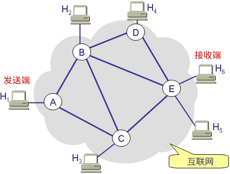
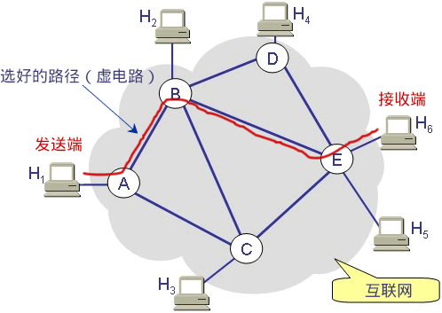

# 面向连接和无连接的套接字区别

## 前言

前面提到，流格式套接字（Stream Sockets）就是“面向连接的套接字”，它基于 TCP 协议；数据报格式套接字（Datagram Sockets）就是“无连接的套接字”，它基于 UDP 协议。

## 面向连接与无连接

**从字面上理解，面向连接好像有一条管道**，它连接发送端和接收端，数据包都通过这条管道来传输。当然，**两台计算机在通信之前必须先搭建好管道。**

**无连接好像没头苍蝇乱撞，数据包从发送端到接收端并没有固定的线路，爱怎么走就怎么走，只要能到达就行。每个数据包都比较自私，不和别人分享自己的线路，但是，大家最终都能殊途同归，到达接收端。**

上图是一个简化的互联网模型，H1 ~ H6 表示计算机，A~E 表示路由器，发送端发送的数据必须经过路由器的转发才能到达接收端。

假设 H1 要发送若干个数据包给 H6，那么有多条路径可以选择，比如：

* 路径 1：H1 --> A --> C --> E --> H6
* 路径 2：H1 --> A --> B --> E --> H6
* 路径 3：H1 --> A --> B --> D --> E --> H6
* 路径 4：H1 --> A --> B --> C --> E --> H6
* 路径 5：H1 --> A --> C --> B --> D --> E --> H6

> **数据包的传输路径是路由器根据算法来计算出来的，算法会考虑很多因素**，比如网络的拥堵状况、下一个路由器是否忙碌等。

## 无连接的套接字

对于无连接的套接字，每个数据包可以选择不同的路径，比如第一个数据包选择路径 4，第二个数据包选择路径 1，第三个数据包选择路径 2……当然，它们也可以选择相同的路径，那也只不过是巧合而已。

每个数据包之间都是独立的，各走各的路，谁也不影响谁，除了迷路的或者发生意外的数据包，最后都能到达 H6。但是，到达的顺序是不确定的，比如：

* 第一个数据包选择了一条比较长的路径（比如路径 5），第三个数据包选择了一条比较短的路径（比如路径 1），虽然第一个数据包很早就出发了，但是走的路比较远，最终还是晚于第三个数据包达到。
* 第一个数据包选择了一条比较短的路径（比如路径 1），第三个数据包选择了一条比较长的路径（比如路径 5），按理说第一个数据包应该先到达，但是非常不幸，第一个数据包走的路比较拥堵，这条路上的数据量非常大，路由器处理得很慢，所以它还是晚于第三个数据包达到了。

还有一些意外情况会发生，比如：

* 第一个数据包选择了路径 1，但是路由器 C 突然断电了，那它就到不了 H6 了。
* 第三个数据包选择了路径 2，虽然路不远，但是太拥堵，以至于它等待的时间太长，路由器把它丢弃了。

**总之，对于无连接的套接字，数据包在传输过程中会发生各种不测，也会发生各种奇迹。H1 只负责把数据包发出，至于它什么时候到达，先到达还是后到达，有没有成功到达，H1 都不管了**；H6 也没有选择的权利，只能被动接收，收到什么算什么，爱用不用。

无连接套接字遵循的是「尽最大努力交付」的原则，就是尽力而为，实在做不到了也没办法。无连接套接字提供没有质量保证的服务。

## 面向连接的套接字

面向连接的套接字在正式通信之前要先确定一条路径，没有特殊情况的话，以后就固定地使用这条路径来传递数据包了。当然，路径被破坏的话，比如某个路由器断电了，那么会重新建立路径。

这条路径是由路由器维护的，路径上的所有路由器都要存储该路径的信息（实际上只需要存储上游和下游的两个路由器的位置就行），所以路由器是有开销的。

H1 和 H6 通信完毕后，要断开连接，销毁路径，这个时候路由器也会把之前存储的路径信息擦除。

在很多网络通信教程中，这条预先建立好的路径被称为“虚电路”，就是一条虚拟的通信电路。

为了保证数据包准确、顺序地到达，发送端在发送数据包以后，必须得到接收端的确认才发送下一个数据包；如果数据包发出去了，一段时间以后仍然没有得到接收端的回应，那么发送端会重新再发送一次，直到得到接收端的回应。这样一来，发送端发送的所有数据包都能到达接收端，并且是按照顺序到达的。

> 发送端发送一个数据包，如何得到接收端的确认呢？很简单，为每一个数据包分配一个 ID，接收端接收到数据包以后，再给发送端返回一个数据包，告诉发送端我接收到了 ID 为 xxx 的数据包。

**面向连接的套接字会比无连接的套接字多出很多数据包，因为发送端每发送一个数据包，接收端就会返回一个数据包。此外，建立连接和断开连接的过程也会传递很多数据包。**

**不但是数量多了，每个数据包也变大了：除了源端口和目的端口，面向连接的套接字还包括序号、确认信号、数据偏移、控制标志（通常说的 URG、ACK、PSH、RST、SYN、FIN）、窗口、校验和、紧急指针、选项等信息；而无连接的套接字则只包含长度和校验信息。**

有连接的数据包比无连接大很多，这意味着更大的负载和更大的带宽。许多即时聊天软件采用 UDP 协议（无连接套接字），与此有莫大的关系。

## 总结

两种套接字各有优缺点：

* 无连接套接字传输效率高，但是不可靠，有丢失数据包、捣乱数据的风险
* 有连接套接字非常可靠，万无一失，但是传输效率低，耗费资源多

两种套接字的特点决定了它们的应用场景，有些服务对可靠性要求比较高，必须数据包能够完整无误地送达，那就得选择有连接的套接字（TCP 服务），比如 HTTP、FTP 等；而另一些服务，并不需要那么高的可靠性，效率和实时才是它们所关心的，那就可以选择无连接的套接字（UDP 服务），比如 DNS、即时聊天工具等。

## Reference

[1] <http://c.biancheng.net/view/2125.html>
