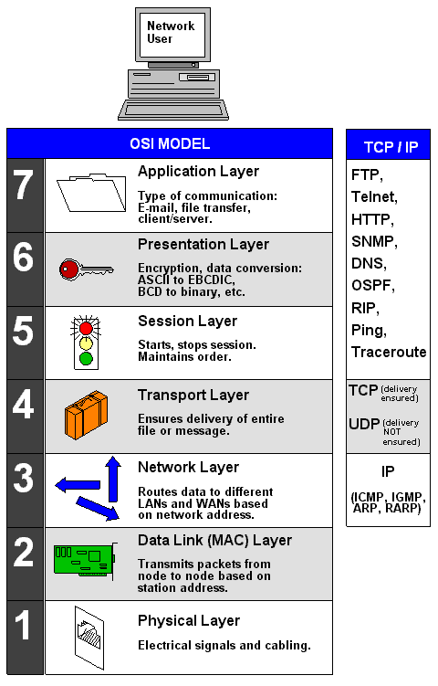

# OSI 网络七层模型

## 概念

它将计算机网络体系结构划分为七层,每层都可以提供抽象良好的接口。了解 OSI 模型有助于理解实际上互联网络的工业标准——TCP/IP 协议。

OSI 模型各层间关系和通讯时的数据流向如图所示：

## 分层设计的原因

分层的目的是也是为了高内聚低耦合，不同的层做不同的事情，这样每一层专注于做好自己的事情就可以了。比如你要向远方的好友邮寄一个封信，需要信封、信纸、邮戳和文字内容等内容，其中不同的东西有不同的作用，一起来完成传递信息这个功能。

## 七层模型介绍

> 物理层对应的物理实体就是网线，水晶头；数据链路层对应的物理实体就是交换机；网络层对应的是路由器。

| 层         | 作用                                                         | 常见协议                                         |
| ---------- | ------------------------------------------------------------ | ------------------------------------------------ |
| 应用层     | 应用层是网络体系中最高的一层，也是唯一面向用户的一层，也可视为为用户提供常用的应用程序，每个网络应用都对应着不同的协议 | HTTP、TFTP, FTP, NFS, WAIS、SMTP                 |
| 表示层     | 数据编码和转化,以确保以一个系统应用层发送的信息 可以被另一个系统应用层识别 | TIFF，GIF，JPEG，PICT，ASCII，EBCDIC，encryption |
| 会话层     | 建立、管理、终止会话。对应主机进程，指本地主机与远程主机正在进行的会话,ssl, tls 就是在这一层进行的 | RPC,SQL，NFS，NetBIOS，names，AppleTalk          |
| 传输层     | 建立、维护和管理端到端的连接，控制数据传输的方式             | TCP/UDP                                          |
| 网络层     | 进行逻辑地址寻址，实现不同网络之间的路径选择。数据传输线路选择，IP 地址及路由选择 | IP, ICMP, ARP, RARP, AKP, UUCP                   |
| 数据链路层 | 是以太网所在的层, 进行物理寻址                               | ARP/RARP/MAC                                     |
| 物理层     | 物理层确保原始的数据可在各种物理媒体上传输,主要是物理介质传输媒介（网线或者是无线） | IEEE 802.1A, IEEE 802.2 到 IEEE 802                |

