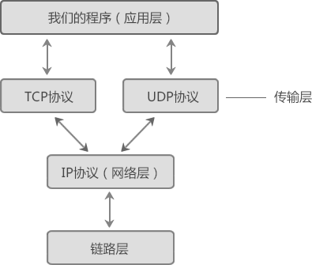

# TCP 四层模型

**目前实际使用的网络模型是 TCP/IP 模型**，它对 OSI 模型进行了简化，只包含了四层，从上到下分别是应用层、传输层、网络层和链路层（网络接口层），每一层都包含了若干协议。

TCP/IP 模型包含了 TCP、IP、UDP、Telnet、FTP、SMTP 等上百个互为关联的协议，其中 TCP 和 IP 是最常用的两种底层协议，所以把它们统称为“TCP/IP 协议族”。

