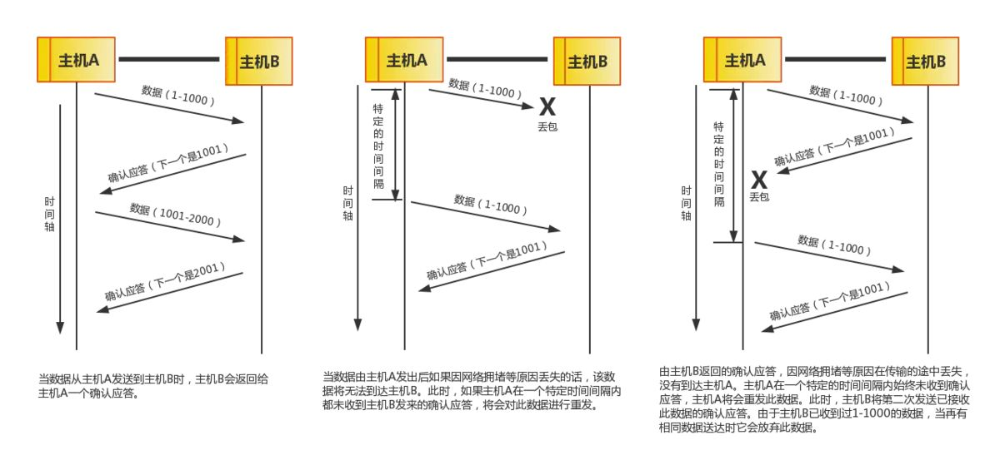
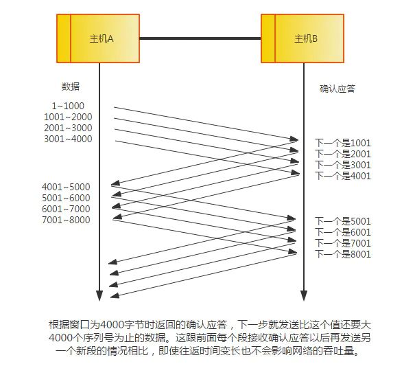
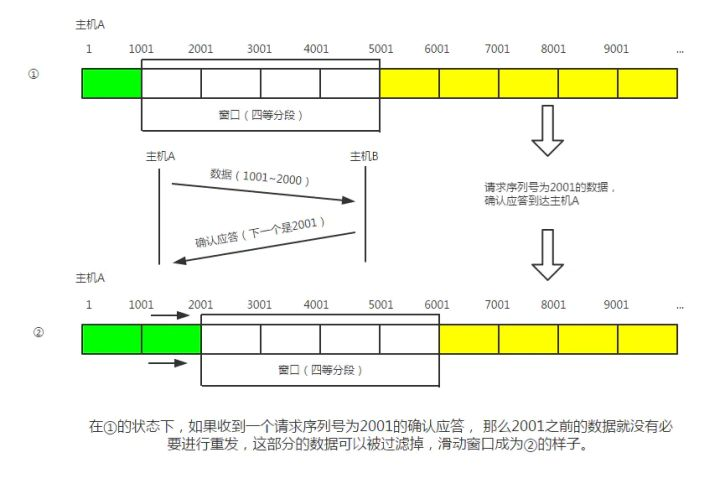
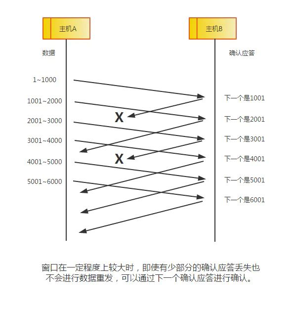
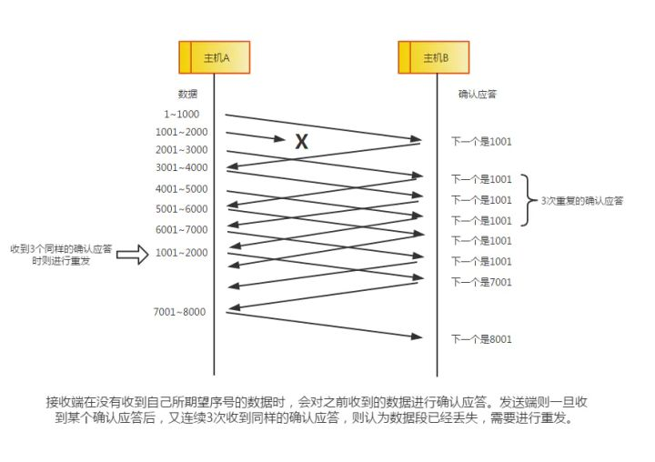

# TCP 如何提供可靠性传输

## 通过序列号与确认应答提高可靠性

> 总结：
>
> * 无论是**数据丢失**、**确认应答消息丢失**、**确认应答消息延迟**三种情况中任何一种，**源主机只需要按照机制超时未收到 ACK 重发数据即可。**
> * **目标主机通过序列号放弃重复的数据包**。

* 在 TCP 中，**当发送端的数据到达接收主机时，接收端主机会返回一个已收到消息的通知。这个消息叫做确认应答（ACK）**。当发送端将数据发出之后会等待对端的确认应答。**如果有确认应答，说明数据已经成功到达对端。**反之，则数据丢失的可能性很大****。
* 在一定时间内没有等待到确认应答，发送端就可以认为数据已经丢失，并进行重发。由此，即使产生了丢包，仍然能够保证数据能够到达对端，实现可靠传输。
* 未收到确认应答并不意味着数据一定丢失。**也有可能是数据对方已经收到，只是返回的确认应答在途中丢失。**这种情况也会导致发送端误以为数据没有到达目的地而重发数据**。**
* **此外，也有可能因为一些其他原因导致确认应答延迟到达，在源主机重发数据以后才到达的情况也屡见不鲜。此时，源主机只要按照机制重发数据即可。**
* 对于目标主机来说，反复收到相同的数据是不可取的。为了对上层应用提供可靠的传输，****目标主机必须放弃重复的数据包。为此我们引入了序列号**。**
* 序列号是按照顺序给发送数据的每一个字节（8 位字节）都标上号码的编号。接收端查询接收数据 TCP 首部中的序列号和数据的长度，将自己下一步应该接收的序列号作为确认应答返送回去。**通过序列号和确认应答号，TCP 能够识别是否已经接收数据，又能够判断是否需要接收，从而实现可靠传输。**

## 重发超时的确定

> **总结：**
>
> * **重发超时时间就是 往返时间 + 偏差 + 一些 buffer。**
> * **重发之后还是收不到确认应答，超时时间就会以 2 倍、4 倍进行延长**
> * **重发到一定次数，还未收到任何确认应答返回，就会认为网络或对端主机发生异常，强制关闭链接。**

* **重发超时是指在重发数据之前，等待确认应答到来的那个特定时间间隔。**如果超过这个时间仍未收到确认应答，发送端将进行数据重发。最理想的是，找到一个最小时间，它能保证“确认应答一定能在这个时间内返回”。
* TCP 要求不论处在何种网络环境下都要提供高性能通信，并且无论网络拥堵情况发生何种变化，都必须保持这一特性。**为此，它在每次发包时都会计算往返时间及其偏差。将这个往返时间和偏差时间相加，重发超时的时间就是比这个总和要稍大一点的值**。
* 在 BSD 的 Unix 以及 Windows 系统中，超**时都以 0.5 秒为单位进行控制，因此重发超时都是 0.5 秒的整数倍。不过，最初其重发超时的默认值一般设置为 6 秒左右。**
* 数据被重发之后若还是收不到确认应答，则进行再次发送。**此时，等待确认应答的时间将会以 2 倍、4 倍的指数函数延长。**
* **此外，**数据也不会被无限、反复地重发。达到一定重发次数之后，如果仍没有任何确认应答返回，就会判断为网络或对端主机发生了异常，强制关闭连接。并且通知应用通信异常强行终止。****

## 以段为单位发送数据

* 在建立 TCP 连接的同时，**也可以确定发送数据包的单位，我们也可以称其为“最大消息长度”（MSS）。**最理想的情况是**，最大消息长度正好是 IP 中不会被分片处理的最大数据长度**。
* TCP 在传送大量数据时，是以 MSS 的大小将数据进行分割发送。进行重发时也是以 MSS 为单位。
* MSS 在三次握手的时候，在两端主机之间被计算得出。两端的主机在发出建立连接的请求时，会在 TCP 首部中写入 MSS 选项**，告诉对方自己的接口能够适应的 MSS 的大小。然后会在两者之间选择一个较小的值投入使用**。

## 利用窗口控制提高速度

* **TCP 以 1 个段为单位，每发送一个段进行一次确认应答的处理。这样的传输方式有一个缺点，就是包的往返时间越长通信性能就越低**。
* **为解决这个问题，TCP 引入了窗口这个概念。确认应答不再是以每个分段，而是以更大的单位进行确认**，转发时间将会被大幅地缩短。也就是说，发送端主机，在发送了一个段以后不必要一直等待确认应答，而是继续发送。如下图所示：

> **窗口大小就是指无需等待确认应答而可以继续发送数据的最大值。上图中窗口大小为 4 个段。这个机制实现了使用大量的缓冲区，通过对多个段同时进行确认应答的功能。**

## 滑动窗口控制

* **上图中的窗口内的数据即便没有收到确认应答也可以被发送出去**。不过，在整个窗口的确认应答没有到达之前，如果其中部分数据出现丢包，那么发送端仍然要负责重传。**为此，发送端主机需要设置缓存保留这些待被重传的数据，直到收到他们的确认应答**。
* 在滑动窗口以外的部分包括未发送的数据以及已经确认对端已收到的数据。当数据发出后若如期收到确认应答就可以不用再进行重发，此时数据就可以从缓存区清除。
* 收到确认应答的情况下，将窗口滑动到确认应答中的序列号的位置。这样可以顺序地将多个段同时发送提高通信性能。这种机制也别称为滑动窗口控制。

## 窗口控制中的重发控制

在使用窗口控制中， 出现丢包一般分为两种情况：

* 情况一：确认应答未能返回的情况。在这种情况下，数据已经到达对端，是不需要再进行重发的，如下图：

* 情况二：某个报文段丢失的情况。接收主机如果收到一个自己应该接收的序列号以外的数据时，会针对当前为止收到数据返回确认应答。如下图所示，当某一报文段丢失后，发送端会一直收到序号为 1001 的确认应答，因此，在窗口比较大，又出现报文段丢失的情况下，**同一个序列号的确认应答将会被重复不断地返回。而发送端主机如果连续 3 次收到同一个确认应答，就会将其对应的数据进行重发。这种机制比之前提到的超时管理更加高效，因此也被称为高速重发控制。**

