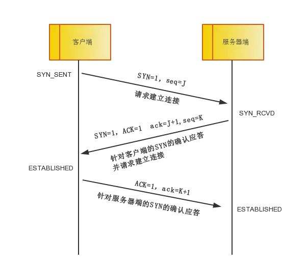

# 三次握手

**TCP 提供面向有连接的通信传输。面向有连接是指在数据通信开始之前先做好两端之间的准备工作。**

所谓三次握手是指建立一个 TCP 连接时需要客户端和服务器端总共发送三个包以确认连接的建立。在 socket 编程中，这一过程由 **客户端执行 connect** 来触发。

三次握手的流程图如下：

* 第一次握手：客户端将标志位 SYN 置为 1，随机产生一个值 seq=J ，并将该数据包发送给服务器端，客户端进入 SYN_SENT 状态，等待服务器端确认。
* 第二次握手：服务器端收到数据包后由标志位 SYN=1 知道客户端请求建立连接，服务器端将标志位 SYN 和 ACK 都置为 1，ack=J+1，随机产生一个值 seq=K，并将该数据包发送给客户端以确认连接请求，服务器端进入 SYN_RCVD 状态。
* 第三次握手：客户端收到确认后，检查 ack 是否为 J+1，ACK 是否为 1，如果正确则将标志位 ACK 置为 1，ack=K+1，并将该数据包发送给服务器端，服务器端检查 ack 是否为 K+1，ACK 是否为 1，如果正确则连接建立成功，客户端和服务器端进入 ESTABLISHED 状态，完成三次握手，随后客户端与服务器端之间可以开始传输数据了。
