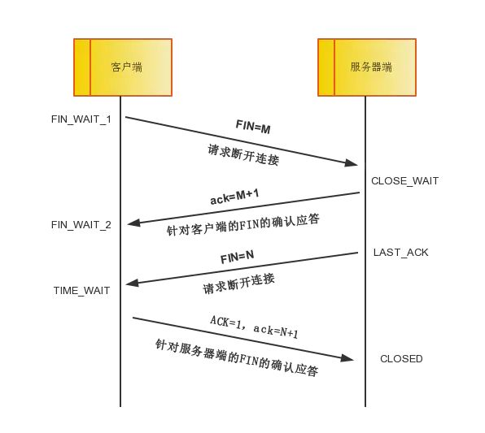
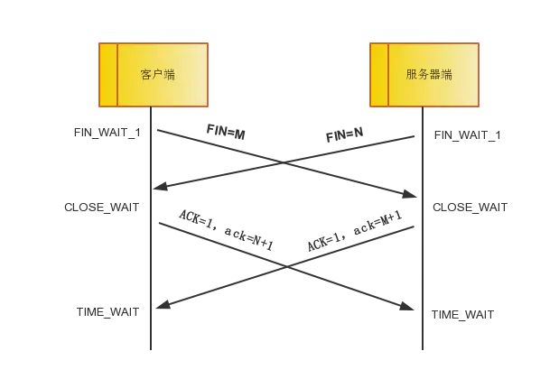

# 四次握手

## 一方主动关闭

四次挥手即终止 TCP 连接，就是指断开一个 TCP 连接时，需要客户端和服务端总共发送 4 个包以确认连接的断开。在 socket 编程中，这一过程由 **客户端或服务端任一方执行 close** 来触发。

> 由于 TCP 连接是全双工的，因此，每个方向都必须要单独进行关闭，这一原则是当一方完成数据发送任务后，发送一个 FIN 来终止这一方向的连接，收到一个 FIN 只是意味着这一方向上没有数据流动了，即不会再收到数据了，但是在这个 TCP 连接上仍然能够发送数据，直到这一方向也发送了 FIN。首先进行关闭的一方将执行主动关闭，而另一方则执行被动关闭。

四次握手的流程图如下：

> 中断连接端可以是客户端，也可以是服务器端。

* 第一次挥手：客户端发送一个 FIN=M，用来关闭客户端到服务器端的数据传送，客户端进入 FIN_WAIT_1 状态。**意思是说“我客户端没有数据要发给你了”，但是如果你服务器端还有数据没有发送完成，则不必急着关闭连接，可以继续发送数据。**
* 第二次挥手：服务器端收到 FIN 后，先发送 ack=M+1，告诉客户端，你的请求我收到了，**但是我还没准备好，请继续你等我的消息。这个时候客户端就进入 FIN_WAIT_2 状态，继续等待服务器端的 FIN 报文。**
* 第三次挥手：当服务器端确定数据已发送完成，则向客户端发送 FIN=N 报文，告诉客户端，好了，我这边数据发完了，准备好关闭连接了。服务器端进入 LAST_ACK 状态。
* 第四次挥手：**客户端收到 FIN=N 报文后，就知道可以关闭连接了，但是他还是不相信网络，怕服务器端不知道要关闭，所以发送 ack=N+1 后进入 TIME_WAIT 状态，如果 Server 端没有收到 ACK 则可以重传。服务器端收到 ACK 后，就知道可以断开连接了。****客户端等待了 2MSL 后依然没有收到回复，则证明服务器端已正常关闭，**那好，我客户端也可以关闭连接了。最终完成了四次握手。

**上面是一方主动关闭，另一方被动关闭的情况，实际中还会出现同时发起主动关闭的情况，**

## 同时主动关闭

具体流程如下图：

