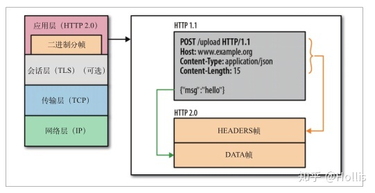
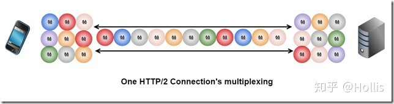
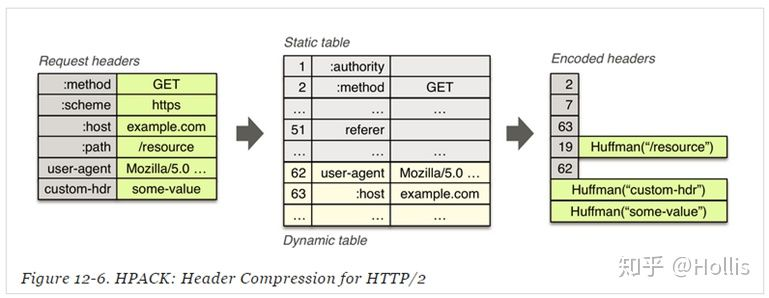
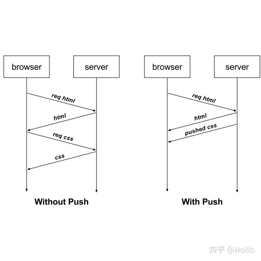

# Http2.0

## **二进制分帧**

在 HTTP/2 中，在应用层（HTTP2.0）和传输层（TCP 或者 UDP）之间加了一层：二进制分帧层。这是 HTTP2 中最大的改变。HTTP2 之所以性能会比 HTTP1.1 有那么大的提高，很大程度上正是由于这一层的引入。

在二进制分帧层中， HTTP/2 会将所有传输的信息分割为更小的消息和帧（frame）,并对它们采用二进制格式的编码。这种单连接多资源的方式，减少了服务端的压力，使得内存占用更少，连接吞吐量更大。而且，TCP 连接数的减少使得网络拥塞状况得以改善，同时慢启动时间的减少，使拥塞和丢包恢复速度更快。

## 多路复用

> **多路复用是可以同时处理多个请求，长连接是复用一个连接，先后处理多个请求，**

多路复用允许同时通过单一的 HTTP/2.0 连接发起多重的请求 - 响应消息。在 HTTP1.1 协议中，浏览器客户端在同一时间，针对同一域名下的请求有一定数量的限制，超过了这个限制的请求就会被阻塞。而多路复用允许同时通过单一的 HTTP2.0 连接发起多重的“请求 - 响应”消息。

HTTP2 的请求的 TCP 的 connection 一旦建立，后续请求以 stream 的方式发送。每个 stream 的基本组成单位是 frame（二进制帧）。客户端和服务器可以把 HTTP 消息分解为互不依赖的帧，然后乱序发送，最后再在另一端把它们重新组合起来。

也就是说， HTTP2.0 通信都在一个连接上完成，这个连接可以承载任意数量的双向数据流。就好比，我请求一个页面 [http://www.hollischuang.com](https://link.zhihu.com/?target=http%3A//www.hollischuang.com) 。页面上所有的资源请求都是客户端与服务器上的一条 TCP 上请求和响应的！

## **header 压缩**

HTTP/1.1 的 header 带有大量信息，而且每次都要重复发送。HTTP/2 为了减少这部分开销，采用了 HPACK 头部压缩算法对 Header 进行压缩。

## **服务端推送**

简单来讲就是当用户的浏览器和服务器在建立连接后，服务器主动将一些资源推送给浏览器并缓存起来的机制。有了缓存，当浏览器想要访问已缓存的资源的时候就可以直接从缓存中读取了。

